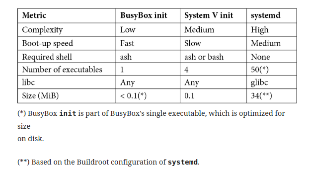

# init programs 

We will follow the data described in [here-ch13-Mastering-Embedded-Linux](https://learning.oreilly.com/library/view/mastering-embedded-linux/9781789530384/B11566_13_Final_NM_ePub.xhtml#_idParaDest-328) 

There are many possible implementations of **init** but here we discuss:

- Busybox init
- System V init
- systemd 


## Introduction

The **init** program is the ancestor of all other processes, to show this you can use:

```sh
pstree -gn
```


**init** is used to:

-  During boot, after the kernel transfers control, the init program 
   -  **starts other daemon programs** and 
   -  **configures system parameters** and 
   -  **other things needed to get the system into a working state**.

-  It **adopts processes that become orphaned** as a result of their immediate parent terminating and there being no other processes in the thread group.
-  It **responds to any of the init's immediate children terminating by catching the SIGCHLD signal and collecting the return value to prevent them from becoming zombie processes.**
-  Optionally, 
  -  it launches a **login daemon**, such as getty, on terminals that allow
    a login shell.
  -  it **restarts those daemons that have terminated**.

-  It handles the **system shutdown**. (in short handles the lifecycle of the system from bootup to shutdown)

- In **other schools** init can also **handle other runtime events** for ex. new hardware and the loading and unloading of modules. This is what **systemd** does.



## Busybox init

minimal init program -> use configuration file **/etc/inittab**, use also **/etc/init.d** which have shell scripts under it


**Buildroot** use has two scripts **rcS** and **rcK**, which are used to run **rcS<0-99>** & **rcK<0-99>**  

## System V

program is the bigger version of the busybox **init**

**System V** init has two advantages over **busybox** init

- Boot scripts are **Well-known, Modular format, easy to add new packages at build time or runtime**
- **runlevels concept**, allow collection of programs that are     started or stopped when switching from one runlevel to another

### runlevels

There are eight **runlevels**, numbered from **0** to **6**, plus **S**:

- **S**: Runs startup tasks
- **0**: Halts the system
- **1** to **5**: Available for general use
- **6**: Reboots the system

conventionally:

- **1**: Single user
- **2**: Multi-user without network configuration
- **3**: Multi-user with network configuration
- **4**: Not used
- **5**: Multi-user with graphical login

The **init** program starts the default **runlevel** given by the **initdefault** line in **/etc/inittab** as follows:

```sh
id:3:initdefault:
```

you can change the runlevel at runtime by using 

```sh
# telinit [runlevel]
telinit 3
```

> INIT: Switching to runlevel: 3

switching runtime multiple times will be recorded like this when you run **runlevel** command to know current runlevel

```sh
# runlevel was started with 5 and changed using `telinit` to 5
runlevel
```

> 5   3 

you can override the runlevel to single user(1) by passing kernel commandline like this `1`:

```sh
console=ttyAMA0 root=/dev/mmcblk1p2 1
```


Each runlevel has a number of **start** and **kill** scripts

when switching between runlevels 

- kill scripts are executed
-  Demons are sent a **SIGTERM** signal (demons don't have a run nor kill script)


The author note

In truth, runlevels are not used that much in embedded Linux: most devices simply boot to the default runlevel and stay there. I have a feeling that it is partly because most people are not aware of them.

### inittab

system V init program  starts by reading **/etc/inittab** 

format of each line

```sh
id:runlevels:action:process
```

- **id**: A unique identifier of up to four characters.
- **runlevels**: The runlevels for which this entry should be executed. This was left blank in the BusyBox **inittab**.
- **action**: One of the keywords given in the following paragraph. same as busybox
- **process**: The command to run.

#### Actions

The actions are as follows:

**sysinit**: Runs the program when init starts before any of the other types
of actions.
**respawn**: Runs the program and restarts it if it terminates. It is typically used to run a program as a daemon.
**askfirst**: This is the same as respawn, but it prints the message Please press Enter to activate this console to the console, and it runs the program after Enter has been pressed. It is used to start an interactive shell on
a terminal without prompting for a username or password.
**once**: Runs the program once but does not attempt to restart it if it terminates.
**wait**: Runs the program and waits for it to complete.
**restart**: Runs the program when init receives the SIGHUP signal, indicating that it should reload the inittab file.
**ctrlaltdel**: Runs the program when init receives the SIGINT signal, usually as a result of pressing Ctrl + Alt + Del on the console.
**shutdown**: Runs the program when init shuts down.


complete **inittab** can be supplied by the yocto project **core-image-minimal** for the **qemuarm** machine -> **check in yocto**

Example of **inittab**

- **id:5:initdefault**, sets the default **runlevel** to **5**.

- **si::sysinit:/etc/init.d/rcS**, runs the **rcS** script at bootup

- **l0:0:wait:/etc/init.d/rc 0**

  **l1:1:wait:/etc/init.d/rc 1**

  **l2:2:wait:/etc/init.d/rc 2**

  **l3:3:wait:/etc/init.d/rc 3**

  **l4:4:wait:/etc/init.d/rc 4**

  **l5:5:wait:/etc/init.d/rc 5**

  **l6:6:wait:/etc/init.d/rc 6**

  They run the **/etc/init.d/rc** script each time there is a **change** in the **runlevel**. This script is responsible for processing the **start** and
  **kill** scripts.

- **AMA0:12345:respawn:/sbin/getty 115200 ttyAMA0**

  runs a **getty** daemon to generate a login prompt on **/dev/ttyAMA0** when entering runlevels **1** through **5**, thereby allowing you to log on and get an interactive shell

- **\# Boot-time system configuration/initialization script.**

  **\# This is run first except when booting in emergency (-b) mode.**

  **si::sysinit:/etc/init.d/rcS**

  The **/etc/init.d/rcS** script that is run by the **sysinit** entry does little more than entering the runlevel, **S**, **rc S:**

  ```sh
  #!/bin/sh
  
  […]
  
  exec /etc/init.d/rc S # run level s never displayed (default start up before default runlevel)
  ```

### The init.d scripts


### adding  a new demon

Ex. **System V ini script for simpleserver**

```sh
#! /bin/sh
case "$1" in
      start)
           echo "Starting simpelserver"
           start-stop-daemon -S -n simpleserver -a /usr/bin/simpleserver
           ;;
     stop)
           echo "Stopping simpleserver"
           start-stop-daemon -K -n simpleserver
           ;;
     *)
           echo "Usage: $0 {start|stop}"
           exit 1
esac
exit 0
```


### starting and stoping services

usage

```sh
/etc/init.d/syslog --help
```

> Usage: syslog { start | stop | restart }

stop service

```sh
/etc/init.d/syslog stop
```

> Stopping syslogd/klogd: stopped syslogd (pid 198)
> stopped klogd (pid 201)
> done

start service

```sh
/etc/init.d/syslog start
```

>  Starting syslogd/klogd: done

- All scripts implement **start** and **stop**, and they should also implement **help**.
- Some scripts implement **status** as well, which will tell you whether the service is running or not.

- Mainstream distributions that still use System V **init** have a command named **service** to start and stop services, which hides the details of calling the scripts directly.


## systemd

how is it better than System V **init** for embedded systems?

- easier and well formatted
- explicit dependencies instead of handling dependencies by two numbers  in script name in system V
- It is easy to set the permissions and resource limits for each service, which is important for security.
- It can monitor services and restart them when needed.
- Services are started in parallel, so it reduce booting time


work with **glibc** don't with **ulibc** nor **musl**

[Link to systemd code](https://github.com/systemd/systemd), Requiremets are in **README** 

yocto default is "System V" but can be changed by setting in **local.conf** `INIT_MANAGER = "systemd"`


### concepts

**unit:** 

- **A configuration file** that describe a target, a service and several other things.
- text files that contain properties and values
- `systemd units` is what you need to start.

  types of systemd units:

  - Service
  - Mount
  - Timer
  - Automount
  - Target
  - Path
  - and more

**service:**

- **A demon** that can be started, stopped and a status that defines its state(running, stopped, ...)

**target:**

- **A group** of services

  - a target can run another target, in a tree of dependencies
  - when the `allow_isolate=yes` then the target file is the endpoint of execution. only then target is considered as a run level.

- **Default target**: is the group of services that are started at boot time.

  

### Units

**unit** files can be found in:

1. **/etc/systemd/system**: Local configuration
2. **/run/systemd/system**: Runtime configuration
3. **/lib/systemd/system**: Distribution-wide configuration

**systemd** searches directories in that order, you can override the  **/lib/systemd/system (distro conf)** by adding unit file in **/etc/systemd/system**

All unit files begin with a section marked **[Unit]**

**Unit section** contain basic information and dependencies

Ex, **D-Bus service**

```sh
[Unit]
Description=D-Bus User Message Bus
Documentation=man:dbus-daemon(1)
Requires=dbus.socket

[Service]
ExecStart=@EXPANDED_BINDIR@/dbus-daemon --session --address=systemd: --nofork --nopidfile --systemd-activation --syslog-only
ExecReload=@EXPANDED_BINDIR@/dbus-send --print-reply --session --type=method_call --dest=org.freedesktop.DBus / org.freedesktop.DBus.ReloadConfig
```

Note:

Description, Documentation link and dependency (**required**)

#### Dependency

**outgoing** Dependency (this module depend on, used to create dependency between targets) in units can be define using:

- **Requires**: A list of units that this unit depends on that are started when this unit is started.
- **Wants**: A weaker form of **Requires**; the units listed are started but the current unit is not stopped if any of them fail.
- **Conflicts**: A negative dependency; the units listed are stopped when this one is started and, conversely, if one of them is started, this one is stopped.

**incoming dependencies** (used to create links between services and targets)

- **WantedBy**: can be used to attach your service to specific target


The **Before** and **After** keywords determine the order in which they are started. The order of stopping is just the reverse of the start order:

- **Before**: Start this unit before the units listed.
- **After**: Start this unit after the units listed.

Ex. 

the **After** directive makes sure that the **web server** is started **after** the **network subsystem** is started

```sh
[Unit]
Description=Lighttpd Web Server
After=network.target
```


### Services

A service is a daemon that can be started and stopped.

A service is a type of unit file with a name ending in **.service**, Ex. **lighttpd.service**

A service unit has a **[Service]** section that describes how it should be run.

Ex. **lighttpd.service**:

```sh
[Service]
ExecStart=/usr/sbin/lighttpd -f /etc/lighttpd/lighttpd.conf -D
ExecReload=/bin/kill -HUP $MAINPID
```

Note: These are the commands to run when starting the service and restarting it.

for more information ` man systemd.service` 


### Targets

A **target** is another type of unit that **groups services** (or other types of units).

A target is a **meta-service** in that respect and also serves as a synchronization point. (like **runlevel**)

Targets have names ending in **.target**, for example,**multi-user.target**.

Ex. **multi-user.target**

```sh
[Unit]
Description=Multi-User System
Documentation=man:systemd.special(7)
Requires=basic.target
Conflicts=rescue.service rescue.target
After=basic.target rescue.service rescue.target
AllowIsolate=yes
```

This says that the basic target must be started before the multi-user target.

It also says that since it conflicts with the rescue target, 

starting the rescue target will cause the multi-user target to be stopped first.


### How systemd boots the system ?

systemd runs by the kernel as a result of being a symbolic link to **/sbin/init**

**/sbin/init**------ is symbolic link to --------> **/lib/systemd/systemd** 

then 

systemd runs the **default.target**

**default.target**------ is symbolic link to --------> **\<desired target>** Ex. multi-user.target, graphical.target 

```sh
/etc/systemd/system/default.target -> /lib/systemd/system/multi-user.target
```


then 

starting a **target** such as multi-user.target creates a **tree of dependencies** that bring the system into working state

in typical system

**multi-user.target** depends on **basic.target**, which depends on **sysinit.target**, which depends on the **services** that need to be started early.

you can print a text graph using

```sh
systemctl list-dependencies
```

you can list all services and their current state using

```sh
systemctl list-units --type service
```

you can do the same for targets using

```sh
systemctl list-units --type target
```


### adding you own service 

using **simpleserver** Example [repo link](https://github.com/PacktPublishing/Mastering-Embedded-Linux-Programming-Third-Edition/tree/master/Chapter13) create this file **simpleserver.service**

```sh
[Unit]
Description=Simple server
[Service]
Type=forking
ExecStart=/usr/bin/simpleserver
[Install]
WantedBy=multi-user.target
```

The **[Unit]** section only contains a description so that it shows up correctly when listed using **systemctl** and other commands. There are no dependencies; as I said, it is very simple.

The **[Service]** section points to the executable and has a flag to indicate that it forks. If it were even simpler and ran in the foreground, **systemd** would do the daemonizing for us and **Type=forking** would not be needed.

The **[Install]** section creates an incoming dependency on **multi-user.target** so that our server is started when the system goes into the multi-user mode.


then place it (the unit) in **/etc/systemd/system/simpleserver.service**

then you can start and stop it using 

```sh
# start simpleserver program
systemctl start simpleserver
# stop simplesever program
sytemctl stop simpleserver
```

you can also find it's current status using

```sh
systemctl status simpleserver
```

At this point, it will only start and stop on command


To make it **persistent**, **permanent** we execute -------> **[Install]** section purpose

```sh
systemctl enable simpleserver
```

> Created symlink from /etc/systemd/system/multiuser.target.wants/simpleserver.service to /etc/systemd/system/simpleserver.service.

Note: 

Now, you can see how services add dependencies without having to keep on editing target unit files. A target can have a directory named **<target_name>.target.wants**, which can contain links to services.

This is exactly the same as adding the dependent unit to the **[Wants]** list in the target.


If this is an important service, you might want to **restart it if it fails**. You can accomplish that by adding this flag to the **[Service]** section:

```sh
[Service]
...
Restart=on-abort
```

Other options for **Restart** are **on-success**, **on-failure**, **on-abnormal**, **on-watchdog**, **on-abort**, or **always**


# Exercise

## Exercise setup

we have build 3 images  using different techniques to have the 3 different initialization systems available 

- **busybox init** - we already built through out the exercises

- **systemv** - built using yocto default **core-minimal-image** for beaglebone-yocto machine

- **systemd** - built using yocto by adding those lines in **local.conf**

  - ```sh
    DISTRO_FEATURES_append = " systemd"   # add systemd to distro features
    DISTRO_FEATURES_BACKFILL_CONSIDERED += "sysvinit" # remove the systemv from distro features
    VIRTUAL-RUNTIME_init_manager = "systemd" # assign init_manager as systemd
    VIRTUAL-RUNTIME_initscripts = "systemd-compat-units" # assign initscripts to systemd-compact-units, allow us to use `systemctl`

we  defined a folder for every File System:

- `rfs_bb` for busybox
- `bb_sysdv` for systemV
- `bb_sysd` for systemd

we set the `/etc/exports` file to 

```sh
/home/ahmed/rfs_bb 192.168.7.100(rw,no_root_squash,no_subtree_check)
/home/ahmed/bb_sysv 192.168.7.100(rw,no_root_squash,no_subtree_check)
/home/ahmed/bb_sysd 192.168.7.100(rw,no_root_squash,no_subtree_check)
```

run `sudo exportfs -r`


Then we defined a `bootargs` variable for each in uboot

```sh
setenv bootargs_busybox "setenv bootargs console=ttyS0,115200 root=/dev/nfs ip=192.168.7.100:::::eth0 nfsroot=192.168.7.1:/home/ahmed/rfs_bb,nfsvers=3,tcp rw init=/sbin/init"
setenv bootargs_sysv "setenv bootargs console=ttyS0,115200 root=/dev/nfs ip=192.168.7.100:::::eth0 nfsroot=192.168.7.1:/home/ahmed/bb_sysv,nfsvers=3,tcp rw init=/sbin/init"
setenv bootargs_sysd "setenv bootargs console=ttyS0,115200 root=/dev/nfs ip=192.168.7.100:::::eth0 nfsroot=192.168.7.1:/home/ahmed/bb_sysd,nfsvers=3,tcp rw init=/sbin/init"
saveenv
```

 

we defined a `bootcmd` variable for each in uboot

```sh
setenv bootcmd_busybox 'run bootargs_busybox; tftp 0x80200000 zImage; tftp 0x82000000 am335x-boneblack.dtb; bootz 0x80200000 - 0x82000000'
setenv bootcmd_sysv 'run bootargs_sysv; tftp 0x80200000 zImage_sysv; tftp 0x82000000 am335x-boneblack_sys.dtb; bootz 0x80200000 - 0x82000000'
setenv bootcmd_sysd 'run bootargs_sysd; tftp 0x80200000 zImage_sysd; tftp 0x82000000 am335x-boneblack_sys.dtb; bootz 0x80200000 - 0x82000000'
saveenv
```


to run any of the 3 init images we only have to stop in u-boot and run one of the 3 commands mentioned below

```sh
run bootcmd_busybox
#or
run bootcmd_sysv
#or
run bootcmd_sysd
```


Note: 

you may have to run `sudo chown -R root:root . ` inside rootfilesystem files on pc, if you faced this error at login

> beaglebone-yocto login: root
> login: can't set groups: Operation not permitted
> Poky (Yocto Project Reference Distro) 3.1.20 beaglebone-yocto /dev/ttyS0


## side command

```sh
sudo ip addr add 192.168.7.1/24 dev enp42s0
# make sure no other interfaces with the same ip
```

## Exercise

 we need to start our application `readapp` in startup in 3 cases:

- busybox init
- systemv init
- systemd init

we will use a statically build version of the `readapp` application

1. we copy `readapp` into the `/bin` folder inside the 3 file systems and make sure that it have execution permission `chmod +x readapp`

2. we create the scripts mentioned in each section 

3. `reboot` and start the target -> the application should start  and you should see

   ```sh
   Making threadpool with 4 threads
   Thread #3044616096 working on stdinRead
   Text from stdin: 
   Thread #3053008800 working on opening file filename
   open_read_file() open() failed: No such file or directory
   open_read_file() read() failed: Bad file descriptor
   
   ```

4. `shutdown now` we should see the application terminating 

   ```sh
   shuting down the readapp application
   ```

   

### busybox init

in busybox init to start and shutdown an application we create 2 files and modify `inittab` to add those files to execution

- `/etc/init.d/rcS1`

  ```sh
  echo "rcs1 is here"
  readapp &
  ```

- `/etc/init.d/rcK1`

  ```sh
  echo "shuting down the readapp application"
  pkill -e readapp
  sleep 3
  ```

- we add two lines to the `inittab`

  ```sh
  # execute at start of the system
  ::sysinit:/etc/init.d/rcS1
  
  # execute at shutdown of the system 
  ::shutdown:/etc/init.d/rcK1
  ```


### SystemV init

in SystemV we have to 

- create a script that starts, stop the application `/etc/init.d/readapp`

`/etc/init.d/readapp`

```sh
#! /bin/sh
case "$1" in
      start)
           echo "Starting readapp........."
           start-stop-daemon -S -n readapp -a /bin/readapp &
           ;;
     stop)
           echo "Stopping readapp........."
           start-stop-daemon -K -n readapp
           ;;
     *)
           echo "Usage: $0 {start|stop}"
           exit 1
esac
exit 0
```

- we can now start and stop application with 

  - usage

  ```sh
  /etc/init.d/readapp --help
  ```

  > Usage: /etc/init.d/readapp {start|stop}

  - stop service

  ```sh
  /etc/init.d/readapp stop
  ```

  > Thread #3044943776 working on stdinRead
  > Text from stdin: 
  > Thread #3053336480 working on opening file filename
  > open_read_file() open() failed: No such file or directory
  > open_read_file() read() failed: Bad file descriptor
  >
  > printing_demon is up and running

  - start service

  ```sh
  /etc/init.d/readapp start
  ```

  >  Stopping readapp.........
  >  Terminated
  >  Stoping readapp application........
  >
  >  stopped readapp (pid 293 288)

  

- then add this script to one of the `rc<x>.d` folders to specify on what run level we will start the application

  ```sh
  # from file system root we create a symbolic link to our application and place it in one of the rc<runlevel> folders(runlevel)
  ln -s ../init.d/readapp ./etc/rc5.d/S40readapp.sh
  # this simplic link file is named `S40`, S -> will call our script with `start` as argument, `40` priority or order of execution
  ```

- To kill the application at when getting in specific runlevel we create similar symbolic link

  ```sh
  ln -s ../init.d/readapp ./etc/rc5.d/K40readapp.sh
  ln -s ../init.d/readapp ./etc/rc4.d/K40readapp.sh
  ```

  to kill the application we execute

  ```sh
  telinit 4 # switching to runlevel 4 will kill the application
  ```


### Systemd init

In Systemd we

- we need to create  in systemd filesystem `./etc/systemd/system/readapp.service`

```sh
[Unit]
Description=readapp server
[Service]
Type=simple
ExecStart=/bin/readapp

[Install]
WantedBy=multi-user.target
```

then you can start and stop it using 

```sh
# start readapp program
systemctl start readapp
```

>no output

but if you execute `ps ` command on terminal it will show that the application is running  

```sh
# stop readapp program
systemctl stop readapp
```

> no output

but if you execute `ps ` command on terminal it will show that the application is **not** there  

using 

```sh
systemctl status readapp
```

> * readapp.service - readapp server
>      Loaded: loaded (/etc/systemd/system/readapp.service; disabled; vendor preset: disabled)
>      Active: inactive (dead)
>
> Sep 20 10:53:37 beaglebone-yocto readapp[158]: printing_demon is up and running
> Sep 20 10:53:57 beaglebone-yocto readapp[158]: printing_demon is up and running
> Sep 20 10:53:57 beaglebone-yocto readapp[158]: printing_demon is up and running
> Sep 20 10:53:57 beaglebone-yocto readapp[158]: printing_demon is up and running
> Sep 20 10:53:57 beaglebone-yocto readapp[158]: printing_demon is up and running
> Sep 20 10:53:57 beaglebone-yocto readapp[158]: printing_demon is up and running
> Sep 20 10:53:57 beaglebone-yocto readapp[158]: Stoping readapp application........
> Sep 20 10:53:57 beaglebone-yocto systemd[1]: Stopping readapp server...
> Sep 20 10:53:57 beaglebone-yocto systemd[1]: readapp.service: Succeeded.
> Sep 20 10:53:57 beaglebone-yocto systemd[1]: Stopped readapp server.

At this point, it will only start and stop on command

to see the full log of our application we 

```sh
journalctl -u readapp.service
#or for current boot only
journalctl -u readapp.service -b 
```

> 

To make it **persistent**, **permanent** (application will boot for multiuser.target by default) we execute -------> **[Install]** section purpose

```sh
systemctl enable readapp
```

> Created symlink /etc/systemd/system/multi-user.target.wants/readapp.service -> /etc/systemd/system/readapp.service.

then restart 

```sh
reboot
ps # not application is there Executing 
```

> ... 
>
> 147 root     35644 S    /bin/readapp
>
> ...

**Note:** 

Now, you can see how services add dependencies without having to keep on editing target unit files. A target can have a directory named **<target_name>.target.wants**, which can contain links to services.

This is exactly the same as adding the dependent unit to the **[Wants]** list in the target.


**TODO:** can you make the application log to terminal like systemv and busybox ? 
