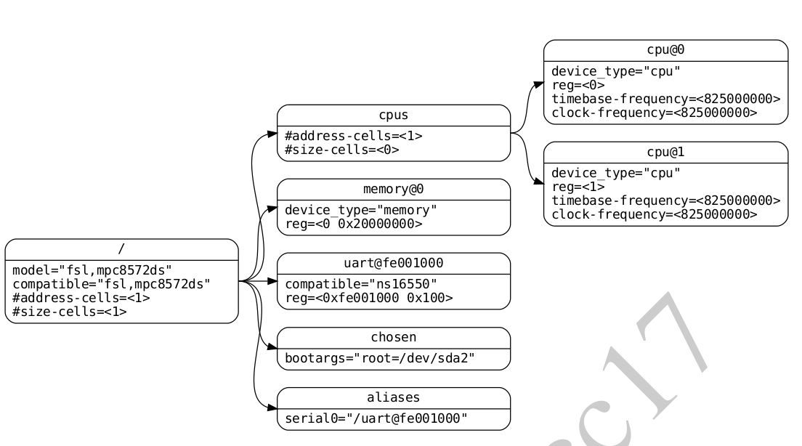
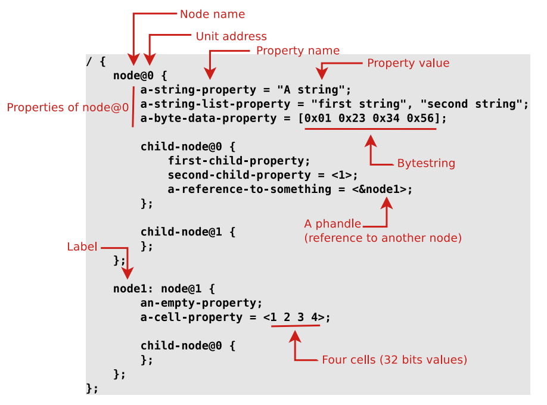

# Introduction to Device Trees

What is device tree ? 

- A device tree is a **tree-structured** **data format** that represents information about the **devices** on a **board**.

  - **Tree Structured** and always start with `/` @ the root of the tree

    Ex. 

  - **devices** on **board**, like in the Example we have an `fsl,mpc8572ds` that have

    - **cpus**
      - **cpu@0** and **cpu@1**: 2 cpus running with clock 825 MHz
    - **memory@0**: RAM from 0x0 to 0x20 Mbyte 
    - **uart@fe001000**: that is memory mapped to 0xfe001000
    - **chosen**: specific area that can be modified by the bootloader at runtime to pass parameters
    - **aliases**: another name for uart@fe001000

## Tree Structure data format

- consists of nodes

  - naming convention of nodes is ***node-name@unit-address***

- each node have some properties

  - properties is formated as  ***property=value***
  - some properties are Standard and others are user specific, you can find them in [device tree specification](https://github.com/devicetree-org/devicetree-specification/releases/tag/v0.3)

- This tree structure is used in kernel, u-boot and TF-A

  - The software using the device tree can access the device tree blob data by using `libfdt`

  - While Linux starts it can read the content of the device tree either by configuring the kernel with `CONFIG_PROC_DEVICETREE` 

    - you can access the device tree under `/proc/device-tree`, For Example

    ```
    echo $(cat /proc/device-tree/board)
    ```

    ```
    echo $(cat /proc/device-tree/serial-number)
    ```

    ```
    echo $(cat /proc/device-tree/compatible)
    ```

    ```
    echo $(cat /proc/device-tree/chosen/bootargs)
    ```

  -  `/sys/firmware/devicetree/base`  represents the **binary devicetree** which you can use with the **dtc** to get **dts** by using

    - ```sh
      dtc -I fs /sys/firmware/devicetree/base
      ```

    - you can also navigate through device tree by using Linux file system

      ```sh
      ls -l /sys/firmware/devicetree/base
      ```

# Device Tree Syntax




# References

- [Device tree 101 video](https://www.youtube.com/watch?v=a9CZ1Uk3OYQ&t=1989s)
  - [slides](https://bootlin.com/pub/conferences/2021/webinar/petazzoni-device-tree-101/petazzoni-device-tree-101.pdf)
- [good references for device tree](https://elinux.org/Device_Tree_Reference)
- https://elinux.org/Device_Tree_Usage
- [Linux Device Drivers Platform](https://www.youtube.com/watch?v=pIUTaMKq0Xc)