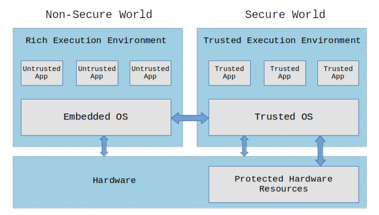
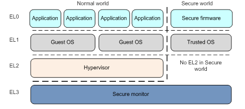
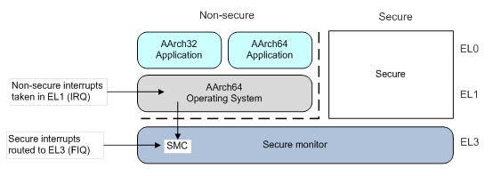

# what is trusted zone, Trusted Execution Environment (TEE) and trusted firmware 

for main **reference** see [here](https://sergioprado.blog/introduction-to-trusted-execution-environment-tee-arm-trustzone/) for TEE and trusted zone

### A Trusted Execution Environment (TEE):

 is an **environment** where the code executed and the data accessed is isolated and protected in terms of confidentiality (no one have access to the data) and integrity (no one can change the code and its behavior).

TEE aim at creating an isolated environment where, even if the operating system is compromised, your data is protected. This is what we call a Trusted Execution Environment or TEE.

### TEE usages:

- TEE would be a good solution to storage and manage the **device encryption keys** that could be used to verify the integrity of the operating system.
- TEE is well-suited for **implementing biometric authentication methods** (facial recognition, fingerprint sensor and voice authorization), isolating resources within a device to store the **biometric algorithm**, **user credentials** and **associated data**.
- TEE could be used in **mobile e-commerce applications** like mobile wallets, peer-to-peer payments or contactless payments to store and manage **credentials** and **sensitive data**.
- TEE is also a suitable environment for **protecting digital copyrighted information** (books, movies, audio, etc) on connected devices such as smartphones, tablets and smart TVs. While the digital content is protected during transmission or streaming using encryption, a TEE would protect the content once it has been decrypted on the device by ensuring that **decrypted content is not exposed to the operating system environment**.

### TEE Terminology and operation 

in TEE we have the following components:

- Untrusted Apps
- Trusted Apps 
- trusted OS
- Embedded OS



Although the diagram above exemplifies a TEE with an operating system (Trusted OS), we could just have a **bare-metal firmware** exposing an **interface** with **exclusive access** to certain **hardware resources**.

In a TEE, all trusted applications (TAs) and associated data is completely isolated from the normal (untrusted) operating system and their applications. Also, trusted applications must run in isolation from other trusted applications and from the TEE itself.

Also, TEE only accept code for execution that has been **appropriately authorized** and **checked by other authorized code**. So in TEE, we need a **secure boot feature** to check the integrity and authenticity of all operating system components (bootloaders, kernel, filesystems, trusted applications, etc). This ensures that nobody has tampered with the operating system’s code when the device was powered off.

TEE is really an **execution environment** (with or without an operating system) that has **exclusive access to certain hardware resources**. But how it is implemented? 

### TEE Implementation:

 We could isolate applications in a “**sandbox**”, for example using **containers**. This would **prevent** an **application** from seeing and accessing data from **other applications**.

But what about the kernel? How to prevent a code running in kernel space from being exploited to access a certain peripheral or memory region used by a trusted application?

**Software can’t protect software!**

So we need support in the **hardware** to **implement a TEE**. We need a way to partition and isolate the hardware (busses, peripherals, memory regions, interrupts, etc) so that the running code does not have access to protected resources.

That’s where [ARM’s TrustZone](https://developer.arm.com/ip-products/security-ip/trustzone), [RISC-V’s MultiZone](https://hex-five.com/multizone-security-sdk/) and many other solutions come in.

#### ARM Trustzone

Usually, an **ARM Cortex-A** processor has 3 execution modes: **user mode**, **kernel mode** and **hypervisor mode**.

In a typical system running GNU/Linux, the **applications** run in **user mode**, the **Linux kernel** runs in **kernel** mode and the **hypervisor mode is not used.**

ARM’s TrustZone introduces a new mode: the **secure monitor mode**.



The idea here is to **partition the hardware** (memory regions, busses, peripherals, interrupts, etc) between the **Secure World** and the **Non-Secure World** in a way that **only trusted applications running on a TEE in the Secure World have access to protected resources**.

The transition from the Secure World to the Non-Secure World is via a dedicated instruction called **Secure Monitor Call** (SMC). 

When this instruction(**Secure Monitor Call** (SMC)) is executed, the CPU will enter in **monitor mode** and will have access to all hardware, including the protected peripherals and memory regions. At this moment, we can run the TEE firmware/operating system.



#### As an example, 

- Imagine an untrusted application running on Linux that wants a service from a trusted application running on a TEE OS.
- The untrusted application will use an API to send the request to the Linux kernel,
- The Linux kernel will use the TrustZone drivers to send the request to the TEE OS via SMC instruction,
-  The TEE OS will pass along the request to the trusted application.

### TEE Implementations

 Several commercial TEE implementations have been developed over the years:

- [Kinibi](https://www.trustonic.com/solutions/trustonic-secured-platforms-tsp/) is the TEE implementation from Trustonic that is used to protect application-level processors, such as the ARM Cortex-A range, and are used on several smartphone Trustzonedevices like the Samsung Galaxy S series.
- On newer smartphones, Samsung is using its own implementation called [TEEGRIS](https://developer.samsung.com/teegris/overview.html), a system-wide secuTrustzonerity solution that allows you to run applications in a trusted execution environment based on TrustZone.
- Qualcomm has its own TEE implementation called [Qualcomm Secure Execution Environment](https://www.qualcomm.com/media/documents/files/guard-your-data-with-the-qualcomm-snapdragon-mobile-platform.pdf) (QSEE) that is also used on a lot of smartphone devices.
- [iTrustee](https://www.huawei.com/en/about-huawei/sustainability/stable-secure-network/privacy-protection) is the Huawei implementation of a TEE operating system for ARM’s TrustZone.TrustzoneTrustzone

We have also some open source TEE implementations:

- [Trusty](https://source.android.com/security/trusty) is an open source project from Google that implements a TEE for Android. It is compatible with ARM’s TrustZone and Intel’s Virtualization Technology.
- [OP-TEE](https://www.op-tee.org/) (Open Portable Trusted Execution Environment) is an open source TEE designed as a companion to a non-secure Linux kernel running on ARM Cortex-A cores using the TrustZone technology.

And there are many more implementations. Although we can implement a TEE anyway we want, an organization called [GlobalPlatform](https://globalplatform.org/) is behind the [standards for TEE interfaces and implementation](https://globalplatform.org/specs-library/?filter-committee=tee).

### TEE variabilities Examples

A TEE implementation is just another layer of security and has its own attack surfaces that could be exploited. And numerous vulnerabilities were already found in different implementations of a TEE using TrustZone!

For example, [several vulnerabilities were found by Gal Beniamini](https://googleprojectzero.blogspot.com/2017/07/trust-issues-exploiting-trustzone-tees.html) including userland privilege escalation to gain code execution in the Secure World.

In a presentation at Black Hat USA 2019 called [Breaking Samsung’s ARM TrustZone](https://www.youtube.com/watch?v=uXH5LJGRwXI&t=22s), Maxime Peterlin talks about how his team at Quarkslab exploited a vulnerability in Kinibi (TEE used on some Samsung devices) to obtaining code execution in monitor mode.

In another talk at CCC 2017 called [Microarchitectural Attacks on Trusted Execution Environments](https://www.youtube.com/watch?v=G8-3G_cep4M), Keegan Ryan provides an overview of different attacks applied to TEEs based on TrustZone implementations.

### Trusted Firmware

see https://chromium.googlesource.com/external/github.com/ARM-software/arm-trusted-firmware/+/v0.4-rc1/docs/firmware-design.md


# what does it mean .so.3.2 ? 

for shared libraries look [here](https://tldp.org/HOWTO/Program-Library-HOWTO/shared-libraries.html)


Each library will have a specific version.

For Example `libjpeg` release `8.2.2` have an is named `libjpeg.so.8.2.2` & there is a symbolic link `libjpeg.so` pointing to this library

`-ljpeg` will link to `libjpeg.so` -> `libjpeg.so.8.2.2`

Installing `8.2.3` will update `libjpeg.so` link to -> `libjpeg.so.8.2.3` 


Now suppose that version `9.0.0` comes along and that breaks the backward compatibility. The link from `libjpeg.so` now points -> `libjpeg.so.9.0.0`,

Any programs on the target that are not recompiled are going to fail in some way, because they are still using the old interface. This is where an object known as the soname helps. The soname encodes the interface number when the library was built and is used by the runtime linker when it loads the library. It is formatted as **library name**.so.**interface number**. 

For `libjpeg.so.8.2.2`, the soname is `libjpeg.so.8` because the **interface number** when that `libjpeg` shared library was built is **8**:

you can check the soname by using 

```sh
readelf -a /usr/lib/x86_64-linux-gnu/libjpeg.so.8.2.2 | grep SONAME
```

> 0x000000000000000e (SONAME)    Library soname: [libjpeg.so.8]

to build library with specific **soname**

```sh
gcc -shared -Wl,-soname,libmystuff.so.1 -o libmystuff.so.1.0.1 a.o b.o -lc
```


# Image vs zImage vs uImage

[ref link](https://stackoverflow.com/questions/22322304/image-vs-zimage-vs-uimage)

**Image**: the generic Linux kernel binary image file.

**zImage**: a compressed version of the Linux kernel image that is self-extracting.

**uImage**: an image file that has a **U-Boot wrapper** (installed by the **[mkimage](https://manpages.ubuntu.com/manpages/xenial/man1/mkimage.1.html#:~:text=The%20mkimage%20command%20is%20used,.%2C%20either%20separate%20or%20combined.)** utility) that includes the OS type and loader information.

A very common practice (e.g. the typical Linux kernel Makefile) is to use a **zImage** file. Since a **zImage** file is self-extracting (i.e. needs no external decompressors), the wrapper would indicate that this kernel is "not compressed" even though it actually is.

Note:

- uboot **bootm** command is used to boot **uImage**

- uboot **bootz** command is used to boot **zImage**


