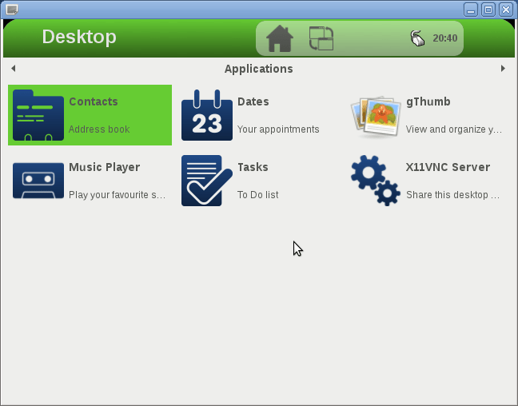
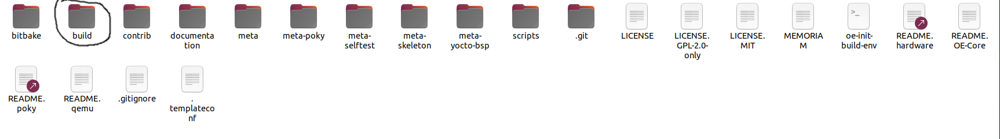
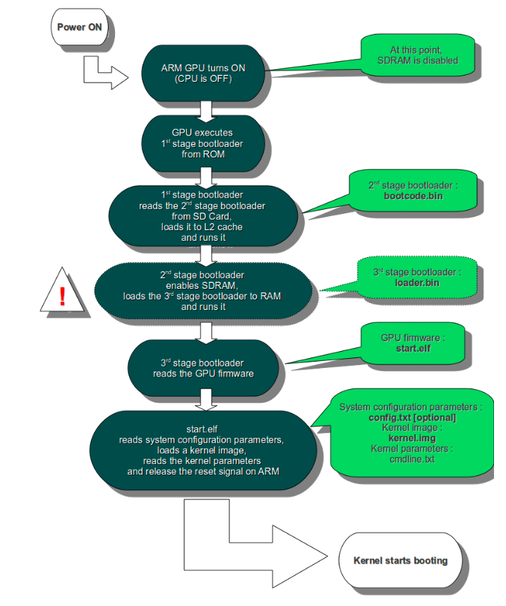

# Building Raspberry pi Image

## Downloading poky and Raspberry pi meta layer

we need to download poky from [here](https://git.yoctoproject.org/poky) but first we need to identify which branch to work on

Identifying the branch to work on:

- we usually pick the LTS branch(long time support branch) as it's the branch that can have work on it and buggs can be fixed if found
- you can be forced to use other EOL branches as the vendor you are working with only support this branch 

Install Requirements using command:

```sh
sudo apt-get install gawk wget git-core diffstat unzip texinfo gcc-multilib \
     build-essential chrpath socat libsdl1.2-dev xterm
```


we picked up **Dunfell** branch

```sh
# getting poky
git clone git://git.yoctoproject.org/poky
git checkout dunfell
```

  we also goto https://layers.openembedded.org/layerindex/ move the branch to **dunfell** check if the raspberry pi meta layer exist:

- [meta-raspberrypi](https://layers.openembedded.org/layerindex/branch/dunfell/layer/meta-raspberrypi/) exist -> checking link you can see recipes, machines, appends and classes that exist on this branch 

- download and checkout the **dunfell** branch

  ```sh
  # getting meta-raspberrypi
  git clone git://git.yoctoproject.org/meta-raspberrypi
  git checkout dunfell
  ```

- we can also download other multiple layers using

  ```sh
  git clone https://github.com/meta-qt5/meta-qt5.git
  git checkout dunfell
  git clone git://git.yoctoproject.org/meta-ti 
  git checkout dunfell
  git clone git://git.openembedded.org/meta-openembedded
  git checkout dunfell
  ```

  

NOTE: 

- that no one Edits poky layer 
  - as it's a common layer between multiple HW and SW vendors.  
  - you may need to update you poky to a newer version

## Go through folder structure of poky


**bitbake**: Holds all scripts used by the BitBake command.

**documentation**: All documentation sources for the Yocto Project documentation. you can build those to pdf documents.

**meta**: Contains the **OpenEmbedded-Core metadata**.

**meta-skeleton**: Contains **template** recipes for BSP and kernel development.

**meta-poky**: Holds the configuration for the **Poky** reference **distribution**.

**meta-yocto-bsp**: Configuration for the Yocto Project reference hardware board support package

**oe-init-build-env**: Script to set up the **OpenEmbedded build environment**.  This script has to be sourced before you start working.

**scripts**: Contain scripts used to setup the environment, development tools and tools to flash the generated images on target.

## Build Raspberrypi Linux Image

### Environement Setup

while building poky and layers like meta-raspberrypi don't change, all files generated are placed in a **build** directory.

sourcing `oe-init-build-env` script creates this **build** folder, and set some environment  variables that enable the use of  `bitbake` (PATH variable)

```sh
#source ./oe-init-build-env [builddir]
source ./oe-init-build-env # would generate folder `build` if variable wasnot passed
```

> ### Shell environment set up for builds. ###
>
> You can now run 'bitbake <target>'
>
> Common targets are:
>     core-image-minimal
>     core-image-sato
>     meta-toolchain
>     meta-ide-support
>
> You can also run generated qemu images with a command like 'runqemu qemux86'
>
> Other commonly useful commands are:
>  - 'devtool' and 'recipetool' handle common recipe tasks
>  - 'bitbake-layers' handles common layer tasks
>  - 'oe-pkgdata-util' handles common target package tasks

- **core-image-minimal**: small image with command line interface
- **core-image-sato**: image with sato support. stato is a GNOME mobile-based user interface
- **meta-toolchain**: Includes development headers and libraries to develop directly on the target
- **meta-ide-support**: Generates the corss-toolchain. Useful when working with the SDK

SATO User interface:



### Configuring the build

after sourcing the script another output should be available `build` folder



`build` folder contains:

**conf**: Configuration files. Image specific and layer configuration

`build/conf` contain: 

- **bblayers.conf**: Explicitly list the available layers.
- **local.conf**: Set up the configuration variables relative to the current user for the build. Configuration variables can be overridden there.


why to set configuration inside the `build` folder ?  

​	The idea is that you can have same layers, same poky, and build with different configurations, different layers, machines, changing some variables 

[Variables link](https://docs.yoctoproject.org/ref-manual/variables.html)configuration variables relative to the current user for the build. Configuration variables can be overridden there.

w

#### bblayer.conf

we need to add vendor layer (**meta-rasbperrypi**) to the existing layers

```sh
# POKY_BBLAYERS_CONF_VERSION is increased each time build/conf/bblayers.conf
# changes incompatibly
POKY_BBLAYERS_CONF_VERSION = "2"

BBPATH = "${TOPDIR}"
BBFILES ?= ""

BBLAYERS ?= " \
  /home/ahmed/Documents/linux_amit/Embedded_linux/Linux-yocto-Excersises/yocto/building_Raspberrypi_image/poky/meta \
  /home/ahmed/Documents/linux_amit/Embedded_linux/Linux-yocto-Excersises/yocto/building_Raspberrypi_image/poky/meta-poky \
  /home/ahmed/Documents/linux_amit/Embedded_linux/Linux-yocto-Excersises/yocto/building_Raspberrypi_image/poky/meta-yocto-bsp \
  /home/ahmed/Documents/linux_amit/Embedded_linux/Linux-yocto-Excersises/yocto/building_Raspberrypi_image/meta-raspberrypi \
  "
```


#### local.conf

we need also to configure our local.conf varaibles:

**BB_NUMBER_THREADS:** How many tasks BitBake should perform in parallel. Defaults to the number of CPUs on the system. `8`

**PARALLEL_MAKE:** How many processes should be used when compiling. Defaults to the number of CPUs on the system `-j 8`

**MACHINE:** The machine the target is built for `raspberrypi2`

```sh
...
# This sets the default machine to be qemux86-64 if no other machine is selected:
#MACHINE ??= "qemux86-64"
MACHINE = "raspberrypi2"
BB_NUMBER_THREADS = "8"
PARALLEL_MAKE = "-j 8"
...

```

it's also useful to set `DL_DIR`, `SSTATE_DIR` and `TMPDIR` to avoid replicating data in different build folders if you are planning multiple builds in `build/local.conf`

```sh
DL_DIR = "/home/ahmed/yocto-training/yocto/downloads"
SSTATE_DIR ?= "/home/ahmed/yocto-training/yocto/sstate-cache"
TMPDIR = "/home/ahmed/yocto-training/yocto/tmp"
```


### Building

to build our image we use bitbake

```sh
# bitbake [options] [recipename/target ...]
bitbake core-image-minimal
```

> Parsing recipes: 100% |##################################################################| Time: 0:00:11
> Parsing of 805 .bb files complete (0 cached, 805 parsed). 1360 targets, 65 skipped, 0 masked, 0 errors.
> NOTE: Resolving any missing task queue dependencies
>
> Build Configuration:
> BB_VERSION           = "1.46.0"
> BUILD_SYS            = "x86_64-linux"
> NATIVELSBSTRING      = "ubuntu-20.04"
> TARGET_SYS           = "arm-poky-linux-gnueabi"
> MACHINE              = "raspberrypi2"
> DISTRO               = "poky"
> DISTRO_VERSION       = "3.1.19"
> TUNE_FEATURES        = "arm vfp cortexa7 neon vfpv4 thumb callconvention-hard"
> TARGET_FPU           = "hard"
> meta                 
> meta-poky            
> meta-yocto-bsp       = "dunfell:a884e8bdbf9b3c8970eea617f82d3d72ff6e47be"
> meta-raspberrypi     = "dunfell:2081e1bb9a44025db7297bfd5d024977d42191ed"
>
> NOTE: Fetching uninative binary shim http://downloads.yoctoproject.org/releases/uninative/3.6/x86_64-nativesdk-libc-3.6.tar.xz;sha256sum=9bfc4c970495b3716b2f9e52c4df9f968c02463a9a95000f6657fbc3fde1f098 (will check PREMIRRORS first)
> Initialising tasks: 100% |###############################################################| Time: 0:00:01
> Sstate summary: Wanted 1160 Found 0 Missed 1160 Current 0 (0% match, 0% complete)
> NOTE: Executing Tasks
> NOTE: Tasks Summary: Attempted 3152 tasks of which 8 didn't need to be rerun and all succeeded.


building will generate those folders:

- **downloads**: Downloaded upstream tarballs of the recipes used in the builds.

- **sstate-cache**: Shared state cache. Used by all builds

- **tmp**: Holds all the build system outputs.

under **tmp/** you can find also:

- **tmp/buildstats/**: Build statistics for all packages built (CPU usage, elapsed time, host,timestamps…).

- **tmp/deploy/**: Final output of the build.

- **tmp/deploy/images/**: Contains the complete images built by the OpenEmbedded build system. These images are used to flash the target.

- **tmp/work/**: Set of specific work directories, split by architecture. They are used to unpack, configure and build the packages. Contains the patched sources, generated objects and logs.

- **tmp/sysroots/**: Shared libraries and headers used to compile applications for the target but also for the host.


## Downloading images to target

### Preparing your SD card

we need now to flash the output image to SD card of raspberry pi, but first let's have a look at how is the raspberrypi boot sequance ?



goto `build/tmp/deploy/images/\<raspberrypi>/bootfiles` you will find all the files mentioned in the boot sequence diagram.

you can modify  `config.txt` to enable and disable some HW from bootloader, also `cmdline.txt` to pass arguments (parameters to kernel) 

we need to setup our SD card to have two partitions as we did before:

1- `boot` partition, formated as fat32 and have all the `bootfiles` folder + dtp files + system image

2- `rootfs`partition formated as ext4 and have the files system (actually depending on your file system format you will have to format your SD card)


```sh
# format the SD card to have two partitions
# list block devices
lsblk
# identify your block(sdb) and delete all of its partitions 
sudo fdisk /dev/sdb
# make your partitions as the image below and write then quit
```


>Syncing disks.

`raspberrypi` (boot) folder must contain 


rootfs is ext3 and must contain the extracted root filesystem 

### letting Yocto prepare SD card for us

we just add to `local.conf` this line 

```sh
IMAGE_FSTYPES +="rpi-sdimg"
```

this will output a single binary file `core-image-minimal-raspberrypi2.rpi-sdimg` that can be flashed directly through the command 

```sh
sudo dd if=tmp/deploy/images/raspberrypi2/core-image-minimal-raspberrypi2.rpi-sdimg of=/dev/sdb bs=1M
```

after this we have to insert the  SD card and power on Raspberry pi,  you should have Linux up and running on Raspberry pi 


# Building Beagle bone Image

to Build beaglebone we clone the `meta-ti` layer using

```sh
git clone git://git.yoctoproject.org/meta-ti
```

- if we then `source oe-init-build-env bb-build`  

- add `poky` and `meta-ti` paths to `bblayers.conf`
- `git checkout dunfell` for each layer
- try `bitbake core-image-minimal` you will get 

> ERROR: Layer 'meta-ti' depends on layer 'meta-arm', but this layer is not enabled in your configuration

there can be some meta layers that depend or need some other layers


Final version of `bb-build/conf/bblayers.conf` after fixing dependencies and adding `meta-qt5` layer

```sh
# POKY_BBLAYERS_CONF_VERSION is increased each time build/conf/bblayers.conf
# changes incompatibly
POKY_BBLAYERS_CONF_VERSION = "2"

BBPATH = "${TOPDIR}"
BBFILES ?= ""

BBLAYERS ?= " \
  /home/ahmed/yocto-training/yocto/layers/poky/meta \
  /home/ahmed/yocto-training/yocto/layers/poky/meta-poky \
  /home/ahmed/yocto-training/yocto/layers/poky/meta-yocto-bsp \
  /home/ahmed/yocto-training/yocto/layers/meta-ti \
  /home/ahmed/yocto-training/yocto/layers/meta-openembedded/meta-oe \
  /home/ahmed/yocto-training/yocto/layers/meta-openembedded/meta-python \
  /home/ahmed/yocto-training/yocto/layers/meta-openembedded/meta-networking \
  /home/ahmed/yocto-training/yocto/layers/meta-openembedded/meta-perl \
  /home/ahmed/yocto-training/yocto/layers/meta-qt5 \
  /home/ahmed/yocto-training/yocto/layers/meta-arm/meta-arm \
  /home/ahmed/yocto-training/yocto/layers/meta-arm/meta-arm-bsp \
  /home/ahmed/yocto-training/yocto/layers/meta-arm/meta-arm-toolchain \
  /home/ahmed/yocto-training/yocto/layers/meta-arm/meta-arm-autonomy \
  /home/ahmed/yocto-training/yocto/layers/meta-virtualization \
  /home/ahmed/yocto-training/yocto/layers/meta-openembedded/meta-filesystems \
  "
~                
```

 

and for `local.conf` we can point to the same folders as raspberrypi it will save us some time as most of the needed packages are already downloaded there 

```sh
DL_DIR = "/home/ahmed/yocto-training/yocto/downloads"
SSTATE_DIR ?= "/home/ahmed/yocto-training/yocto/sstate-cache"
TMPDIR = "/home/ahmed/yocto-training/yocto/tmp"
# MACHINE
MACHINE="beaglebone"
```

 and set also set the `MACHINE` to `beaglebone` then 

```sh
bitbake core-image-base 
```

it will build and place the final images in `tmp/deploy/images`

you can download output images as discussed before either put All images and filesystem on SD card and boot from there or you can place only bootloader on SD card and use it to flash kernel over network and to have a network file system

