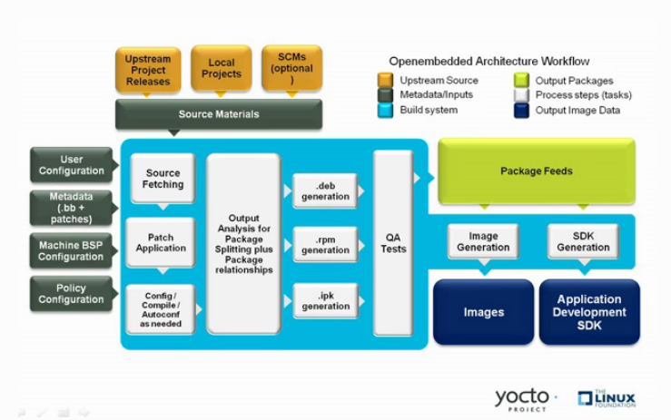
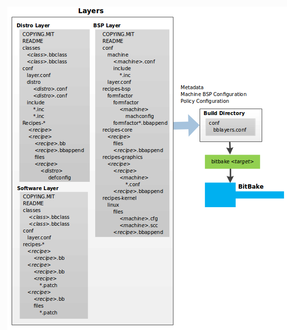
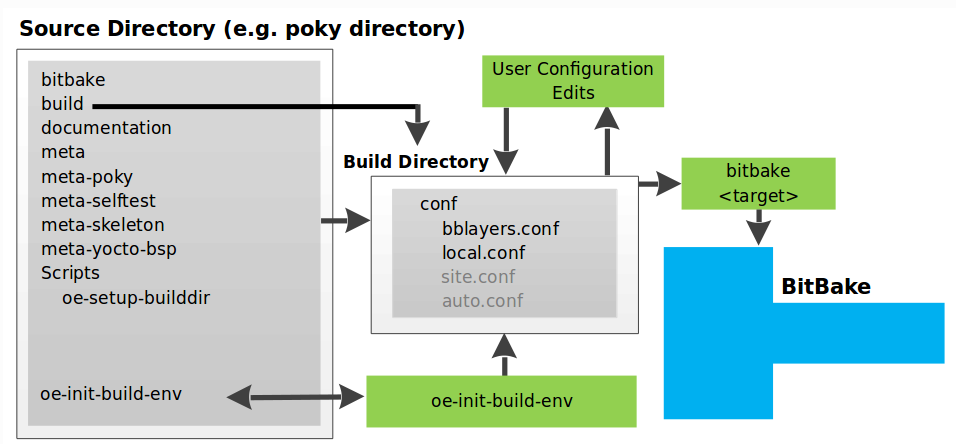
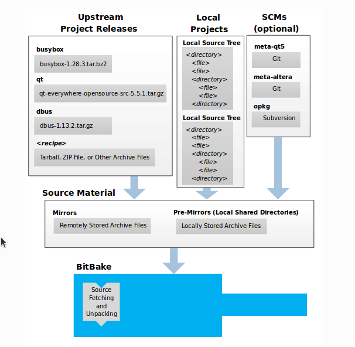
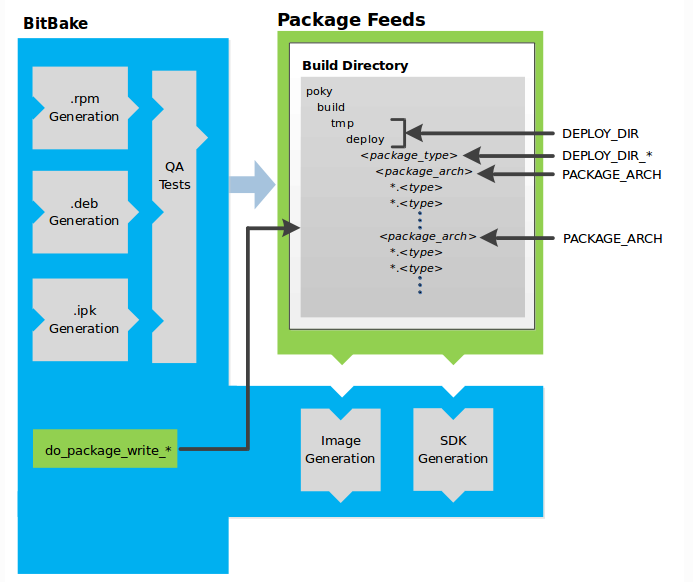

# yocto

This link worth reading: [overview-manual-concepts](https://docs.yoctoproject.org/3.2.3/overview-manual/overview-manual-concepts.html) -> this document is prepared from there



## Input meta-data components:

- ***Recipes**:* Provides details about particular pieces of software. (.**bb**, .**bbapend**, .**inc**)
- ***Class Data**:* Abstracts common build information (e.g. how to build a Linux kernel). (.**bbclass**)
- ***Configuration Data:*** Defines machine-specific settings, policy decisions, and so forth. Configuration data acts as the glue to bind everything together. (.**conf**)

### Configuration data 

#### global configuration data set in local.conf (user configuration)

- *Target Machine Selection:* Controlled by the [MACHINE](https://docs.yoctoproject.org/3.2.3/ref-manual/ref-variables.html#term-MACHINE) variable.
- *Download Directory:* Controlled by the [DL_DIR](https://docs.yoctoproject.org/3.2.3/ref-manual/ref-variables.html#term-DL_DIR) variable.
- *Shared State Directory:* Controlled by the [SSTATE_DIR](https://docs.yoctoproject.org/3.2.3/ref-manual/ref-variables.html#term-SSTATE_DIR) variable.
- *Build Output:* Controlled by the [TMPDIR](https://docs.yoctoproject.org/3.2.3/ref-manual/ref-variables.html#term-TMPDIR) variable.
- *Distribution Policy:* Controlled by the [DISTRO](https://docs.yoctoproject.org/3.2.3/ref-manual/ref-variables.html#term-DISTRO) variable.
- *Packaging Format:* Controlled by the [PACKAGE_CLASSES](https://docs.yoctoproject.org/3.2.3/ref-manual/ref-variables.html#term-PACKAGE_CLASSES) variable.
- *SDK Target Architecture:* Controlled by the [SDKMACHINE](https://docs.yoctoproject.org/3.2.3/ref-manual/ref-variables.html#term-SDKMACHINE) variable.
- *Extra Image Packages:* Controlled by the [EXTRA_IMAGE_FEATURES](https://docs.yoctoproject.org/3.2.3/ref-manual/ref-variables.html#term-EXTRA_IMAGE_FEATURES) variable.

#### MACHINE and DISTRO configuration (machine and policy configuration)

folder structure points to configuration that should be loaded from **.conf** data for example: 

- machine configuration is always found under  **meta/conf/machine**, when setting [MACHINE](https://docs.yoctoproject.org/3.2.3/ref-manual/ref-variables.html#term-MACHINE) to **qemux86** bitbake must find file **qemux86** under some meta-layer that includes **conf/machine** 
- same applies for distributions for variable [DISTRO](https://docs.yoctoproject.org/3.2.3/ref-manual/ref-variables.html#term-DISTRO), always found under **meta/conf/distro** 


place all your layers layer under poky folder:

- if all layers are in the same folder you list all available **machines** through

  ```sh
  find . -path '*/conf/machine/*.conf'
  ```

  > ./meta/conf/machine/qemuppc.conf
  > ./meta/conf/machine/qemux86-64.conf
  > ./meta/conf/machine/qemuarmv5.conf
  > ./meta/conf/machine/qemux86.conf
  > ./meta/conf/machine/qemuriscv64.conf
  > ./meta/conf/machine/qemumips64.conf
  > ./meta/conf/machine/qemuarm64.conf
  > ./meta/conf/machine/qemuarm.conf
  > ./meta/conf/machine/qemumips.conf
  > ./meta-yocto-bsp/conf/machine/beaglebone-yocto.conf
  > ./meta-yocto-bsp/conf/machine/edgerouter.conf
  > ./meta-yocto-bsp/conf/machine/genericx86.conf
  > ./meta-yocto-bsp/conf/machine/genericx86-64.conf
  > ./meta-selftest/conf/machine/qemux86copy.conf
  > ./meta-raspberrypi/conf/machine/raspberrypi4.conf
  > ./meta-raspberrypi/conf/machine/raspberrypi-cm.conf
  > ./meta-raspberrypi/conf/machine/raspberrypi.conf
  > ./meta-raspberrypi/conf/machine/raspberrypi4-64.conf
  > ./meta-raspberrypi/conf/machine/raspberrypi-cm3.conf
  > ./meta-raspberrypi/conf/machine/raspberrypi2.conf
  > ./meta-raspberrypi/conf/machine/raspberrypi0-wifi.conf
  > ./meta-raspberrypi/conf/machine/raspberrypi3.conf
  > ./meta-raspberrypi/conf/machine/raspberrypi3-64.conf
  > ./meta-raspberrypi/conf/machine/raspberrypi0.conf

- you can also list all available distros through

  ```sh
  find . -path '*/conf/distro/*.conf'
  ```

  > ./meta-poky/conf/distro/poky-altcfg.conf
  > ./meta-poky/conf/distro/poky.conf
  > ./meta-poky/conf/distro/poky-bleeding.conf
  > ./meta-poky/conf/distro/poky-tiny.conf
  > ./meta/conf/distro/defaultsetup.conf


## Folder structure

3 types of layer always exist in poky 

- BSP layer (machine)
- Distro layer (distribution)
- software layer

the folder structure of those layers are as follows:



## General work flow 

- To start working on yocto we **source oe-init-build-env** [build folder name]
- **build directory** is created with configuration files in it.

- you (user) modify this configuration then **bitbake \<target>**
- you might have multiple configurations to point to a specific build folder, you must do the first step again with the name of this build folder



## sources

BitBake uses the [SRC_URI](https://docs.yoctoproject.org/3.2.3/ref-manual/ref-variables.html#term-SRC_URI) variable to point to source files regardless of their location

You can also instruct the OpenEmbedded build system to create tarballs from Git repositories, which is not the default behavior, and store them in the `DL_DIR` by using the [BB_GENERATE_MIRROR_TARBALLS](https://docs.yoctoproject.org/3.2.3/ref-manual/ref-variables.html#term-BB_GENERATE_MIRROR_TARBALLS) variable.

**Local projects** sources:

- can be included beside the recipe in a folder
- can be included using recipe variables 
- can be included by using the [externalsrc](https://docs.yoctoproject.org/3.2.3/ref-manual/ref-classes.html#ref-classes-externalsrc) class

**SCM(git or subversion)**:

- BitBake uses the [SRC_URI](https://docs.yoctoproject.org/3.2.3/ref-manual/ref-variables.html#term-SRC_URI) variable and the argument’s prefix to determine the correct fetcher module.
- BitBake uses the [SRCREV](https://docs.yoctoproject.org/3.2.3/ref-manual/ref-variables.html#term-SRCREV) variable to determine the specific revision from which to build.

**Source Mirrors**:

- Bitbake checks the [PREMIRRORS](https://docs.yoctoproject.org/3.2.3/ref-manual/ref-variables.html#term-PREMIRRORS) first for source files, premirrors will contain your organization cache(shared directory) for source files
- Bitbake checks in order **DLDIR** then **PREMIRRORS** then  [MIRRORS](https://docs.yoctoproject.org/3.2.3/ref-manual/ref-variables.html#term-MIRRORS)




## Packages feed

Package feeds are an intermediary step in the build process

BitBake uses the [do_package_write_*](https://docs.yoctoproject.org/3.2.3/ref-manual/ref-tasks.html#ref-tasks-package-write-deb) tasks to generate packages and place them into the package holding area (e.g. `do_package_write_ipk` for IPK packages). See the “[do_package_write_deb](https://docs.yoctoproject.org/3.2.3/ref-manual/ref-tasks.html#ref-tasks-package-write-deb)”, “[do_package_write_ipk](https://docs.yoctoproject.org/3.2.3/ref-manual/ref-tasks.html#ref-tasks-package-write-ipk)”, “[do_package_write_rpm](https://docs.yoctoproject.org/3.2.3/ref-manual/ref-tasks.html#ref-tasks-package-write-rpm)”, and “[do_package_write_tar](https://docs.yoctoproject.org/3.2.3/ref-manual/ref-tasks.html#ref-tasks-package-write-tar)”




- [DEPLOY_DIR](https://docs.yoctoproject.org/3.2.3/ref-manual/ref-variables.html#term-DEPLOY_DIR): Defined as `tmp/deploy` in the Build Directory.

- `DEPLOY_DIR_*`: Depending on the package manager used, the package type sub-folder. Given RPM, IPK, or DEB packaging and tarball creation, the [DEPLOY_DIR_RPM](https://docs.yoctoproject.org/3.2.3/ref-manual/ref-variables.html#term-DEPLOY_DIR_RPM), [DEPLOY_DIR_IPK](https://docs.yoctoproject.org/3.2.3/ref-manual/ref-variables.html#term-DEPLOY_DIR_IPK), [DEPLOY_DIR_DEB](https://docs.yoctoproject.org/3.2.3/ref-manual/ref-variables.html#term-DEPLOY_DIR_DEB), or [DEPLOY_DIR_TAR](https://docs.yoctoproject.org/3.2.3/ref-manual/ref-variables.html#term-DEPLOY_DIR_TAR), variables are used, respectively.

- [PACKAGE_ARCH](https://docs.yoctoproject.org/3.2.3/ref-manual/ref-variables.html#term-PACKAGE_ARCH): Defines architecture-specific sub-folders. For example, packages could exist for the **i586** or **qemux86** architectures.

  

# Bitbake

The bitbake is the tool that take all the mentioned inputs executes then produces the outputs (blue area in [this image](#yocto)) 

- bitbake executes what is in the **recipes(.bb)** depending on **user, machine and distro conf** which set some variables that might affect the recipe
- **user, machine and distro conf** can affect also the recipe selection (which recipes to be included),
- recipes also use **classes(.bbclass)** to inherit some template to follow
- recipes can be extended by using the (**.bbappend**, **.inc**)   
- recipe should contain how to fetch, patch, configure, compile, install and package the components it's building 

in the following sections we see how this is done and important variables that are used by recipes 

## Source Fetching

The first stages of building a recipe are to fetch and unpack the source code:


The [do_fetch](https://docs.yoctoproject.org/3.2.3/ref-manual/ref-tasks.html#ref-tasks-fetch) and [do_unpack](https://docs.yoctoproject.org/3.2.3/ref-manual/ref-tasks.html#ref-tasks-unpack) tasks fetch the source files and unpack them into the [Build Directory](https://docs.yoctoproject.org/3.2.3/ref-manual/ref-terms.html#term-Build-Directory).

BitBake uses the [SRC_URI](https://docs.yoctoproject.org/3.2.3/ref-manual/ref-variables.html#term-SRC_URI) variable to point to source files regardless of their location

The preceding figure and the following list describe the Build Directory’s hierarchy:

- [TMPDIR](https://docs.yoctoproject.org/3.2.3/ref-manual/ref-variables.html#term-TMPDIR): The base directory where the OpenEmbedded build system performs all its work during the build. The default base directory is the `tmp` directory.
- [PACKAGE_ARCH](https://docs.yoctoproject.org/3.2.3/ref-manual/ref-variables.html#term-PACKAGE_ARCH): The architecture of the built package or packages. Depending on the eventual destination of the package or packages (i.e. machine architecture, [Build Host](https://docs.yoctoproject.org/3.2.3/ref-manual/ref-terms.html#term-Build-Host), SDK, or specific machine), `PACKAGE_ARCH` varies. See the variable’s description for details.
- [TARGET_OS](https://docs.yoctoproject.org/3.2.3/ref-manual/ref-variables.html#term-TARGET_OS): The operating system of the target device. A typical value would be “linux” (e.g. “qemux86-poky-linux”).
- [PN](https://docs.yoctoproject.org/3.2.3/ref-manual/ref-variables.html#term-PN): The name of the recipe used to build the package. This variable can have multiple meanings. However, when used in the context of input files, `PN` represents the name of the recipe.
- [WORKDIR](https://docs.yoctoproject.org/3.2.3/ref-manual/ref-variables.html#term-WORKDIR): The location where the OpenEmbedded build system builds a recipe (i.e. does the work to create the package).
  - [PV](https://docs.yoctoproject.org/3.2.3/ref-manual/ref-variables.html#term-PV): The version of the recipe used to build the package.
  - [PR](https://docs.yoctoproject.org/3.2.3/ref-manual/ref-variables.html#term-PR): The revision of the recipe used to build the package.
- [S](https://docs.yoctoproject.org/3.2.3/ref-manual/ref-variables.html#term-S): Contains the unpacked source files for a given recipe.
  - [BPN](https://docs.yoctoproject.org/3.2.3/ref-manual/ref-variables.html#term-BPN): The name of the recipe used to build the package. The `BPN` variable is a version of the `PN` variable but with common prefixes and suffixes removed.
  - [PV](https://docs.yoctoproject.org/3.2.3/ref-manual/ref-variables.html#term-PV): The version of the recipe used to build the package.

## patching

Once source code is fetched and unpacked, BitBake locates patch files and applies them to the source files:


The [do_patch](https://docs.yoctoproject.org/3.2.3/ref-manual/ref-tasks.html#ref-tasks-patch) task uses a recipe’s [SRC_URI](https://docs.yoctoproject.org/3.2.3/ref-manual/ref-variables.html#term-SRC_URI) statements and the [FILESPATH](https://docs.yoctoproject.org/3.2.3/ref-manual/ref-variables.html#term-FILESPATH) variable to locate applicable patch files.

patch files assumes the files have either `*.patch` or `*.diff` file types

see also  “[Use devtool modify to Modify the Source of an Existing Component](https://docs.yoctoproject.org/3.2.3/sdk-manual/sdk-extensible.html#use-devtool-modify-to-modify-the-source-of-an-existing-component)”, “[Using Traditional Kernel Development to Patch the Kernel](https://docs.yoctoproject.org/3.2.3/kernel-dev/kernel-dev-common.html#using-traditional-kernel-development-to-patch-the-kernel)” 

## configuration, compilation and staging

After source code is patched, BitBake executes tasks that configure and compile the source code. Once compilation occurs, the files are copied to a holding area (staged) in preparation for packaging:


This step in the build process consists of the following tasks:

- [do_prepare_recipe_sysroot](https://docs.yoctoproject.org/3.2.3/ref-manual/ref-tasks.html#ref-tasks-prepare-recipe-sysroot): This task sets up the two sysroots in `${`[WORKDIR](https://docs.yoctoproject.org/3.2.3/ref-manual/ref-variables.html#term-WORKDIR)`}` (i.e. `recipe-sysroot` and `recipe-sysroot-native`) so that during the packaging phase the sysroots can contain the contents of the [do_populate_sysroot](https://docs.yoctoproject.org/3.2.3/ref-manual/ref-tasks.html#ref-tasks-populate-sysroot) tasks of the recipes on which the recipe containing the tasks depends. A sysroot exists for both the target and for the native binaries, which run on the host system.
- [do_configure](https://docs.yoctoproject.org/3.2.3/ref-manual/ref-tasks.html#ref-tasks-configure): This task configures the source by enabling and disabling any build-time and configuration options for the software being built. Configurations can come from the recipe itself as well as from an inherited class. Additionally, the software itself might configure itself depending on the target for which it is being built.
- [do_compile](https://docs.yoctoproject.org/3.2.3/ref-manual/ref-tasks.html#ref-tasks-compile):  Compilation occurs in the directory pointed to by the [B](https://docs.yoctoproject.org/3.2.3/ref-manual/ref-variables.html#term-B) variable. Realize that the `B` directory is, by default, the same as the [S](https://docs.yoctoproject.org/3.2.3/ref-manual/ref-variables.html#term-S) directory.
- [do_install](https://docs.yoctoproject.org/3.2.3/ref-manual/ref-tasks.html#ref-tasks-install): copies files from the `B` directory and places them in a holding area pointed to by the [D](https://docs.yoctoproject.org/3.2.3/ref-manual/ref-variables.html#term-D) variable. Packaging occurs later using files from this holding directory.

## package spliting

After source code is configured, compiled, and staged, the build system analyzes the results and splits the output into packages:


The [do_package](https://docs.yoctoproject.org/3.2.3/ref-manual/ref-tasks.html#ref-tasks-package) and [do_packagedata](https://docs.yoctoproject.org/3.2.3/ref-manual/ref-tasks.html#ref-tasks-packagedata) tasks combine to analyze the files found in the [D](https://docs.yoctoproject.org/3.2.3/ref-manual/ref-variables.html#term-D) directory and split them into subsets based on available packages and files. 

Analysis involves the following as well as other items: splitting out debugging symbols, looking at shared library dependencies between packages, and looking at package relationships.

The `do_packagedata` task creates package metadata based on the analysis such that the build system can generate the final packages. The [do_populate_sysroot](https://docs.yoctoproject.org/3.2.3/ref-manual/ref-tasks.html#ref-tasks-populate-sysroot) task stages (copies) a subset of the files installed by the [do_install](https://docs.yoctoproject.org/3.2.3/ref-manual/ref-tasks.html#ref-tasks-install) task into the appropriate sysroot.

Working, staged, and intermediate results of the analysis and package splitting process use several areas (location of folders used):

- [PKGD](https://docs.yoctoproject.org/3.2.3/ref-manual/ref-variables.html#term-PKGD): The destination directory (i.e. `package`) for packages before they are split into individual packages.
- [PKGDESTWORK](https://docs.yoctoproject.org/3.2.3/ref-manual/ref-variables.html#term-PKGDESTWORK): A temporary work area (i.e. `pkgdata`) used by the `do_package` task to save package metadata.
- [PKGDEST](https://docs.yoctoproject.org/3.2.3/ref-manual/ref-variables.html#term-PKGDEST): The parent directory (i.e. `packages-split`) for packages after they have been split.
- [PKGDATA_DIR](https://docs.yoctoproject.org/3.2.3/ref-manual/ref-variables.html#term-PKGDATA_DIR): A shared, global-state directory that holds packaging metadata generated during the packaging process. The packaging process copies metadata from `PKGDESTWORK` to the `PKGDATA_DIR` area where it becomes globally available.
- [STAGING_DIR_HOST](https://docs.yoctoproject.org/3.2.3/ref-manual/ref-variables.html#term-STAGING_DIR_HOST): The path for the sysroot for the system on which a component is built to run (i.e. `recipe-sysroot`).
- [STAGING_DIR_NATIVE](https://docs.yoctoproject.org/3.2.3/ref-manual/ref-variables.html#term-STAGING_DIR_NATIVE): The path for the sysroot used when building components for the build host (i.e. `recipe-sysroot-native`).
- [STAGING_DIR_TARGET](https://docs.yoctoproject.org/3.2.3/ref-manual/ref-variables.html#term-STAGING_DIR_TARGET): The path for the sysroot used when a component that is built to execute on a system and it generates code for yet another machine (e.g. cross-canadian recipes).

The [FILES](https://docs.yoctoproject.org/3.2.3/ref-manual/ref-variables.html#term-FILES) variable defines the files that go into each package in [PACKAGES](https://docs.yoctoproject.org/3.2.3/ref-manual/ref-variables.html#term-PACKAGES). If you want details on how this is accomplished, you can look at [package.bbclass](https://git.yoctoproject.org/cgit/cgit.cgi/poky/tree/meta/classes/package.bbclass).


## root files system image generation

Once packages are split and stored in the Package Feeds area, the build system uses BitBake to generate the root filesystem image:


The image generation process consists of several stages and depends on several tasks and variables. The [do_rootfs](https://docs.yoctoproject.org/3.2.3/ref-manual/ref-tasks.html#ref-tasks-rootfs) task creates the root filesystem (file and directory structure) for an image. This task uses several key variables to help create the list of packages to actually install:

- [IMAGE_INSTALL](https://docs.yoctoproject.org/3.2.3/ref-manual/ref-variables.html#term-IMAGE_INSTALL): Lists out the base set of packages from which to install from the Package Feeds area.
- [PACKAGE_EXCLUDE](https://docs.yoctoproject.org/3.2.3/ref-manual/ref-variables.html#term-PACKAGE_EXCLUDE): Specifies packages that should not be installed into the image.
- [IMAGE_FEATURES](https://docs.yoctoproject.org/3.2.3/ref-manual/ref-variables.html#term-IMAGE_FEATURES): Specifies features to include in the image. Most of these features map to additional packages for installation.
- [PACKAGE_CLASSES](https://docs.yoctoproject.org/3.2.3/ref-manual/ref-variables.html#term-PACKAGE_CLASSES): Specifies the package backend (e.g. RPM, DEB, or IPK) to use and consequently helps determine where to locate packages within the Package Feeds area.
- [IMAGE_LINGUAS](https://docs.yoctoproject.org/3.2.3/ref-manual/ref-variables.html#term-IMAGE_LINGUAS): Determines the language(s) for which additional language support packages are installed.
- [PACKAGE_INSTALL](https://docs.yoctoproject.org/3.2.3/ref-manual/ref-variables.html#term-PACKAGE_INSTALL): The final list of packages passed to the package manager for installation into the image

With [IMAGE_ROOTFS](https://docs.yoctoproject.org/3.2.3/ref-manual/ref-variables.html#term-IMAGE_ROOTFS) pointing to the location of the filesystem under construction and the `PACKAGE_INSTALL` variable providing the final list of packages to install, the root file system is created.


The final stages of the `do_rootfs` task handle post processing. Post processing includes creation of a manifest file and optimizations.

The manifest file (`.manifest`) resides in the same directory as the root filesystem image. This file lists out, line-by-line, the installed packages. The manifest file is useful for the [testimage](https://docs.yoctoproject.org/3.2.3/ref-manual/ref-classes.html#ref-classes-testimage) class, for example, to determine whether or not to run specific tests. See the [IMAGE_MANIFEST](https://docs.yoctoproject.org/3.2.3/ref-manual/ref-variables.html#term-IMAGE_MANIFEST) variable for additional information.


After the root filesystem is built, processing begins on the image through the [do_image](https://docs.yoctoproject.org/3.2.3/ref-manual/ref-tasks.html#ref-tasks-image) task. The build system runs any pre-processing commands as defined by the [IMAGE_PREPROCESS_COMMAND](https://docs.yoctoproject.org/3.2.3/ref-manual/ref-variables.html#term-IMAGE_PREPROCESS_COMMAND) variable. This variable specifies a list of functions to call before the build system creates the final image output files.


 The formats used for the root filesystem depend on the [IMAGE_FSTYPES](https://docs.yoctoproject.org/3.2.3/ref-manual/ref-variables.html#term-IMAGE_FSTYPES)  variable.


The final task involved in image creation is the [do_image_complete](https://docs.yoctoproject.org/3.2.3/ref-manual/ref-tasks.html#ref-tasks-image-complete) task. This task completes the image by applying any image post processing as defined through the [IMAGE_POSTPROCESS_COMMAND](https://docs.yoctoproject.org/3.2.3/ref-manual/ref-variables.html#term-IMAGE_POSTPROCESS_COMMAND) variable. The variable specifies a list of functions to call once the build system has created the final image output files.

## SDK generation

The OpenEmbedded build system uses BitBake to generate the Software Development Kit (SDK) installer scripts for both the standard SDK and the extensible SDK (eSDK):


The `do_populate_sdk` task helps create the standard SDK and handles two parts: a target part and a host part. The target part is the part built for the target hardware and includes libraries and headers. The host part is the part of the SDK that runs on the [SDKMACHINE](https://docs.yoctoproject.org/3.2.3/ref-manual/ref-variables.html#term-SDKMACHINE).

The `do_populate_sdk_ext` task helps create the extensible SDK and handles host and target parts differently than its counter part does for the standard SDK. For the extensible SDK, the task encapsulates the build system, which includes everything needed (host and target) for the SDK.

## Images

The images produced by the build system are compressed forms of the root filesystem and are ready to boot on a target device. You can see from the [general workflow figure](https://docs.yoctoproject.org/3.2.3/overview-manual/overview-manual-concepts.html#general-workflow-figure) that BitBake output, in part, consists of images. This section takes a closer look at this output:


- **kernel-image**: A kernel binary file. The [KERNEL_IMAGETYPE](https://docs.yoctoproject.org/3.2.3/ref-manual/ref-variables.html#term-KERNEL_IMAGETYPE) variable determines the naming scheme for the kernel image file. Depending on this variable, the file could begin with a variety of naming strings. The `deploy/images/`machine directory can contain multiple image files for the machine.
- **root-filesystem-image**: Root filesystems for the target device (e.g. `*.ext3` or `*.bz2` files). The [IMAGE_FSTYPES](https://docs.yoctoproject.org/3.2.3/ref-manual/ref-variables.html#term-IMAGE_FSTYPES) variable determines the root filesystem image type. The `deploy/images/`machine directory can contain multiple root filesystems for the machine.
- **kernel-modules**: Tarballs that contain all the modules built for the kernel. Kernel module tarballs exist for legacy purposes and can be suppressed by setting the [MODULE_TARBALL_DEPLOY](https://docs.yoctoproject.org/3.2.3/ref-manual/ref-variables.html#term-MODULE_TARBALL_DEPLOY) variable to “0”. The `deploy/images/`machine directory can contain multiple kernel module tarballs for the machine.
- **bootloaders**: If applicable to the target machine, bootloaders supporting the image. The `deploy/images/`machine directory can contain multiple bootloaders for the machine.
- **symlinks**: The `deploy/images/`machine folder contains a symbolic link that points to the most recently built file for each machine. These links might be useful for external scripts that need to obtain the latest version of each file.

## application development SDK


 The following list shows the variables associated with an extensible SDK:

- [DEPLOY_DIR](https://docs.yoctoproject.org/3.2.3/ref-manual/ref-variables.html#term-DEPLOY_DIR): Points to the `deploy` directory.
- [SDK_EXT_TYPE](https://docs.yoctoproject.org/3.2.3/ref-manual/ref-variables.html#term-SDK_EXT_TYPE): Controls whether or not shared state artifacts are copied into the extensible SDK. By default, all required shared state artifacts are copied into the SDK.
- [SDK_INCLUDE_PKGDATA](https://docs.yoctoproject.org/3.2.3/ref-manual/ref-variables.html#term-SDK_INCLUDE_PKGDATA): Specifies whether or not packagedata is included in the extensible SDK for all recipes in the “world” target.
- [SDK_INCLUDE_TOOLCHAIN](https://docs.yoctoproject.org/3.2.3/ref-manual/ref-variables.html#term-SDK_INCLUDE_TOOLCHAIN): Specifies whether or not the toolchain is included when building the extensible SDK.
- [SDK_LOCAL_CONF_WHITELIST](https://docs.yoctoproject.org/3.2.3/ref-manual/ref-variables.html#term-SDK_LOCAL_CONF_WHITELIST): A list of variables allowed through from the build system configuration into the extensible SDK configuration.
- [SDK_LOCAL_CONF_BLACKLIST](https://docs.yoctoproject.org/3.2.3/ref-manual/ref-variables.html#term-SDK_LOCAL_CONF_BLACKLIST): A list of variables not allowed through from the build system configuration into the extensible SDK configuration.
- [SDK_INHERIT_BLACKLIST](https://docs.yoctoproject.org/3.2.3/ref-manual/ref-variables.html#term-SDK_INHERIT_BLACKLIST): A list of classes to remove from the [INHERIT](https://docs.yoctoproject.org/3.2.3/ref-manual/ref-variables.html#term-INHERIT) value globally within the extensible SDK configuration.

This next list, shows the variables associated with a standard SDK:

- [DEPLOY_DIR](https://docs.yoctoproject.org/3.2.3/ref-manual/ref-variables.html#term-DEPLOY_DIR): Points to the `deploy` directory.
- [SDKMACHINE](https://docs.yoctoproject.org/3.2.3/ref-manual/ref-variables.html#term-SDKMACHINE): Specifies the architecture of the machine on which the cross-development tools are run to create packages for the target hardware.
- [SDKIMAGE_FEATURES](https://docs.yoctoproject.org/3.2.3/ref-manual/ref-variables.html#term-SDKIMAGE_FEATURES): Lists the features to include in the “target” part of the SDK.
- [TOOLCHAIN_HOST_TASK](https://docs.yoctoproject.org/3.2.3/ref-manual/ref-variables.html#term-TOOLCHAIN_HOST_TASK): Lists packages that make up the host part of the SDK (i.e. the part that runs on the `SDKMACHINE`). When you use `bitbake -c populate_sdk imagename` to create the SDK, a set of default packages apply. This variable allows you to add more packages.
- [TOOLCHAIN_TARGET_TASK](https://docs.yoctoproject.org/3.2.3/ref-manual/ref-variables.html#term-TOOLCHAIN_TARGET_TASK): Lists packages that make up the target part of the SDK (i.e. the part built for the target hardware).
- [SDKPATH](https://docs.yoctoproject.org/3.2.3/ref-manual/ref-variables.html#term-SDKPATH): Defines the default SDK installation path offered by the installation script.
- [SDK_HOST_MANIFEST](https://docs.yoctoproject.org/3.2.3/ref-manual/ref-variables.html#term-SDK_HOST_MANIFEST): Lists all the installed packages that make up the host part of the SDK. This variable also plays a minor role for extensible SDK development as well. However, it is mainly used for the standard SDK.
- [SDK_TARGET_MANIFEST](https://docs.yoctoproject.org/3.2.3/ref-manual/ref-variables.html#term-SDK_TARGET_MANIFEST): Lists all the installed packages that make up the target part of the SDK. This variable also plays a minor role for extensible SDK development as well. However, it is mainly used for the standard SDK.

# Cross-Development Toolchain Generation 


The chain of events that occurs when `gcc-cross` is bootstrapped is as follows:

```
gcc -> binutils-cross -> gcc-cross-initial -> linux-libc-headers -> glibc-initial -> glibc -> gcc-cross -> gcc-runtime
```

- `gcc`: The build host’s GNU Compiler Collection (GCC).
- `binutils-cross`: The bare minimum binary utilities needed in order to run the `gcc-cross-initial` phase of the bootstrap operation.
- `gcc-cross-initial`: An early stage of the bootstrap process for creating the cross-compiler. This stage builds enough of the `gcc-cross`, the C library, and other pieces needed to finish building the final cross-compiler in later stages. This tool is a “native” package (i.e. it is designed to run on the build host).
- `linux-libc-headers`: Headers needed for the cross-compiler.
- `glibc-initial`: An initial version of the Embedded GNU C Library (GLIBC) needed to bootstrap `glibc`.
- `glibc`: The GNU C Library.
- `gcc-cross`: The final stage of the bootstrap process for the cross-compiler. This stage results in the actual cross-compiler that BitBake uses when it builds an image for a targeted device.
