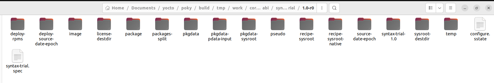

# using Yocto project

## PREFERRED_PROVIDER

let's find out our PREFERRED_PROVIDER's in our Yocto project

```sh
grep -r PREFERRED_PROVIDER_virtual/.*= . 
```

> ...
>
> ./meta-raspberrypi/conf/machine/include/rpi-default-providers.inc:PREFERRED_PROVIDER_virtual/kernel ?= "linux-raspberrypi"
> ./meta-raspberrypi/conf/machine/include/rpi-default-providers.inc:PREFERRED_PROVIDER_virtual/xserver ?= "xserver-xorg"
> ./meta-raspberrypi/conf/machine/include/rpi-default-providers.inc:PREFERRED_PROVIDER_virtual/egl ?= "${@bb.utils.contains("MACHINE_FEATURES", "vc4graphics", "mesa", "userland", d)}"
> ./meta-raspberrypi/conf/machine/include/rpi-default-providers.inc:PREFERRED_PROVIDER_virtual/libgles2 ?= "${@bb.utils.contains("MACHINE_FEATURES", "vc4graphics", "mesa", "userland", d)}"
> ./meta-raspberrypi/conf/machine/include/rpi-default-providers.inc:PREFERRED_PROVIDER_virtual/libgl ?= "${@bb.utils.contains("MACHINE_FEATURES", "vc4graphics", "mesa", "mesa-gl", d)}"
> ./meta-raspberrypi/conf/machine/include/rpi-default-providers.inc:PREFERRED_PROVIDER_virtual/mesa ?= "${@bb.utils.contains("MACHINE_FEATURES", "vc4graphics", "mesa", "mesa-gl", d)}"
> ./meta-raspberrypi/conf/machine/include/rpi-default-providers.inc:PREFERRED_PROVIDER_virtual/libgbm ?= "${@bb.utils.contains("MACHINE_FEATURES", "vc4graphics", "mesa", "mesa-gl", d)}"
> ./meta-raspberrypi/conf/machine/include/rpi-default-providers.inc:PREFERRED_PROVIDER_virtual/libomxil ?= "userland"

note that kernel used is the "linux-raspberrypi" package (recipe), let's find it 

```sh 
find . -name linux-raspberrypi*
```

> ...
>
> ./meta-raspberrypi/recipes-kernel/linux/linux-raspberrypi.inc
> ./meta-raspberrypi/recipes-kernel/linux/linux-raspberrypi_4.19.bb
> ./meta-raspberrypi/recipes-kernel/linux/linux-raspberrypi_4.19.inc
> ./meta-raspberrypi/recipes-kernel/linux/linux-raspberrypi_5.4.bb
> ./meta-raspberrypi/recipes-kernel/linux/linux-raspberrypi-rt_4.19.bb
> ./meta-raspberrypi/recipes-kernel/linux/linux-raspberrypi-rt_4.14.bb
> ./meta-raspberrypi/recipes-kernel/linux/linux-raspberrypi_4.14.bb
> ./meta-raspberrypi/recipes-kernel/linux/linux-raspberrypi_5.4.inc
> ./meta-raspberrypi/recipes-kernel/linux/linux-raspberrypi-dev.bb

you can find its different packages "linux-raspberrypi" with different versions "4.19", "5.4", ...


let's find PREFERRED_VERSION of this package 

```sh
grep -r PREFERRED_VERSION_linux-raspberrypi .
```

> ...
>
> ./meta-raspberrypi/conf/machine/include/rpi-default-versions.inc:PREFERRED_VERSION_linux-raspberrypi ??= "5.4.%"

note selected version is "5.4"


## IMAGE_INSTALL

let's see our image `core-image-minimal`, search for files of the same name 

```sh
find . -name core-image-minimal*
```

> ...
>
> ./poky/meta/recipes-core/images/core-image-minimal-initramfs.bb
> ./poky/meta/recipes-core/images/core-image-minimal.bb
> ./poky/meta/recipes-core/images/core-image-minimal-mtdutils.bb
> ./poky/meta/recipes-core/images/core-image-minimal-dev.bb

take a look on `core-image-minimal.bb`

```sh
vim ./poky/meta/recipes-core/images/core-image-minimal.bb
```

> ... 
>
> IMAGE_INSTALL = "packagegroup-core-boot ${CORE_IMAGE_EXTRA_INSTALL}"
>
> ...

this tells you that a `packagegroup-core-boot` will be added to image + `CORE_IMAGE_EXTRA_INSTALL` variable, 

let's search for CORE_IMAGE_EXTRA_INSTALL

```sh 
grep -r CORE_IMAGE_EXTRA_INSTALL .
```

> ...
>
> ./poky/build/tmp/deploy/images/raspberrypi2/core-image-minimal-raspberrypi2-20220910192322.testdata.json
>
> ...

let's view this file, I think this file contain all the variables of the yocto set after building **core-image-minimal**

### OVERRIDE

search for **OVERRIDE**: 

> "CLASSOVERRIDE": "class-target",
>
> "DISTROOVERRIDES": "poky",
>
> "FILESOVERRIDES": "arm:rpi:armv7ve:raspberrypi2:poky",
>
> "LIBCOVERRIDE": ":libc-glibc",
>
> "MACHINEOVERRIDES": "rpi:armv7ve:raspberrypi2",
>
> "OVERRIDES": "task-rootfs:linux-gnueabi:arm:pn-core-image-minimal:rpi:armv7ve:raspberrypi2:poky:class-target:libc-glibc:forcevariable",

note:

- OVERRIDE variable is composed of values from: CLASSOVERRIDE, DISTROOVERRIDES, LIBCOVERRIDE and MACHINEOVERRIDES

- variables that use the **OVERRIDES** that contain `raspberrypi2`, will apply the value with `_raspberrypi2` postfix for example

let's check some of those variables with `_raspberrypi2` postfix

```sh
grep -r .*_raspberrypi2.*= .
```

> ./poky/documentation/kernel-dev/kernel-dev-common.rst:   KBUILD_DEFCONFIG_raspberrypi2 ?= "bcm2709_defconfig"
> ./poky/documentation/ref-manual/ref-variables.rst:         KBUILD_DEFCONFIG_raspberrypi2 = "bcm2709_defconfig"
> ./meta-raspberrypi/classes/sdcard_image-rpi.bbclass:SDIMG_KERNELIMAGE_raspberrypi2 ?= "kernel7.img"
> ./meta-raspberrypi/recipes-kernel/linux/linux-raspberrypi.inc:KBUILD_DEFCONFIG_raspberrypi2 ?= "bcm2709_defconfig"

in `./meta-raspberrypi/recipes-kernel/linux/linux-raspberrypi.inc` we see the same variable `KBUILD_DEFCONFIG` is set to different values depending on the value that is placed in the **OVERRIDES** variable

```sh
KBUILD_DEFCONFIG_raspberrypi0-wifi ?= "bcmrpi_defconfig"
KBUILD_DEFCONFIG_raspberrypi ?= "bcmrpi_defconfig"
KBUILD_DEFCONFIG_raspberrypi-cm3 ?= "bcm2709_defconfig"
KBUILD_DEFCONFIG_raspberrypi2 ?= "bcm2709_defconfig"
KBUILD_DEFCONFIG_raspberrypi3 ?= "bcm2709_defconfig"
KBUILD_DEFCONFIG_raspberrypi3-64 ?= "bcmrpi3_defconfig"
KBUILD_DEFCONFIG_raspberrypi4 ?= "bcm2711_defconfig"
KBUILD_DEFCONFIG_raspberrypi4-64 ?= "bcm2711_defconfig"
```


who set the **OVERRIDE** variable ? 
```sh
grep -r OVERRIDE.*= . 2>/dev/null 
```

> ...
>
> ./meta-raspberrypi/conf/machine/raspberrypi4-64.conf:MACHINEOVERRIDES = "raspberrypi4:${MACHINE}"
> ./meta-raspberrypi/conf/machine/raspberrypi0.conf:MACHINEOVERRIDES = "raspberrypi:${MACHINE}"
> ./meta-raspberrypi/conf/machine/raspberrypi-cm.conf:MACHINEOVERRIDES = "raspberrypi:${MACHINE}"
> ./meta-raspberrypi/conf/machine/raspberrypi3-64.conf:MACHINEOVERRIDES = "raspberrypi3:${MACHINE}"

note that the machine is selected in the `local.conf` file, looks like the sequance go this way:

- your set the machine in local.conf
- each machine has a configuration 
-  **MACHINEOVERRIDES** is set in this machine configuration, like `raspberrypi3-64.conf`


### IMAGE_INSTALL

let's check the IMAGE_INSTALL in the .json file

```sh 
cat ./poky/build/tmp/deploy/images/raspberrypi2/core-image-minimal-raspberrypi2-20220910192322.testdata.json | grep IMAGE_INSTALL
```

> "IMAGE_INSTALL": "packagegroup-core-boot ", 

includes only the packages required to boot the linux system, let's add SSH support to the image by adding those lines to local.conf

```sh
IMAGE_INSTALL_append = "openssh"
```

then rebuild the image using 

```sh
bitbake core-image-minimal
dd if=poky/build/tmp/deploy/images/raspberrypi2/core-image-minimal-raspberrypi2.rpi-sdimg of=/dev/sdc
```


to configure ip your address you can use 

```sh
ifconfig <interfac-name> <ip-address>/<subnet> # ex. ifconfig enp0s3 192.168.178.32/24
```


## bitbake 

### Remember (bitbake usage):

bitbake [target]

- -c \<task>: execute a given task

- -s: list all locally available recipes and their versions
- -f: force a given task to run by removing its stamp file
- World: keyword for all recipes
- -b \<recipe>: execute tasks from the given recipe (without resolving dependencies)

#### bitbake usage:

list tasks of kernel `virtual/kernel`

```sh
bitbake -c listtasks virtual/kernel # executed the task listtasks :) which list all the tasks (added by default)
# do_<task>

# you can also configure the kernel by running `menuconfig` task
bitbake -c menuconfig virtual/kernel
```


openssh recipe was executed when we added it to image, try executing it again

```sh
bitbake openssh
```

> ...
>
> NOTE: Executing Tasks
> NOTE: Tasks Summary: Attempted 2069 tasks of which 2069 didn't need to be rerun and all succeeded.

try with `-f`

```sh 
bitbake -f openssh 
```


To see which kernel is used, dry-run BitBake:
```sh 
bitbake -vn virtual/kernel
```

> ...
>
> NOTE: selecting linux-raspberrypi to satisfy virtual/kernel due to PREFERRED_PROVIDERS

variables can change from recipes or configuration files to check those changes for a \<variable> we can use:

```sh
# bitbake -e | grep <variable>
bitbake -e | grep OVERRIDES.*=
# note This command displays variable values after the configuration files (i.e. `local.conf`, `bblayers.conf`, `bitbake.conf` and so forth) have been parsed.
```

>DISTROOVERRIDES="poky"
>FILESOVERRIDES="arm:rpi:armv7ve:raspberrypi4:poky"
>MACHINEOVERRIDES="rpi:armv7ve:raspberrypi4"
>OVERRIDES="linux-gnueabi:arm:pn-defaultpkgname:rpi:armv7ve:raspberrypi4:poky:class-target:libc-glibc:forcevariable"
>
>unless the package sets SRC_URI_OVERRIDES_PACKAGE_ARCH=0


## Clean Sstate cache:

```sh
./poky/scripts/sstate-cache-management.sh --remove-duplicated -d --cache-dir=poky/build/sstate-cache/
```


# Recipes syntax

see [this](https://docs.yoctoproject.org/bitbake/bitbake-user-manual/bitbake-user-manual-metadata.html)

### Remember:

- all variables in bitbake is string 
- recipes consist of header, source and tasks
- syntax written in recipes are python or shell 
- variables are set -> `A = "value"` used with syntax`${A}`
- The “=” operator does not immediately expand variable references in the right-hand side. Instead, expansion is deferred until the variable assigned to is actually used. see [trial2](###= trial2)

To start with playing and idetifying some recipes syntax we need to make a **new layer** to include multiple **recipes** that will help us testing recipes syntax. 

### make new custom layer manually

 To make a new layer we just create a new folder `meta-custom/` under `poky/`, then we will introduced some files as follows:

- it's usually advised to start your layer naming with `meta-` but not mandatory, we create the layer folder structure as follows

```sh 
mkdir meta-custom
cd meta-custom
mkdir conf
cd conf
echo "# Append conf and classes directory to BBPATH
BBPATH .= \":\${LAYERDIR}\"

# add folder structure to recipes (.bb) to BBFILES variable
BBFILES += \"\${LAYERDIR}/recipes*/*/*.bb\"
" > layer.conf
cd .. #back to meta-custom/ folder
mkdir recipes-lap2
cd recipes-lap2
mkdir syntax1
cd syntax1
```

### Inserting our recipes (trial1) 

let's write our first recipe in the `syntax1/` we will make a file `syntax-trail_1.0.bb` and include this code in it 

```sh
touch syntax-trial_1.0.bb
```

 open the recipe and add these lines to add a task **display** for this recipe that we will use to print the output 

```sh
SUMMARY = "syntax recipe"
DESCRIPTION = "Recipe for testing yocto recipes syntax"
LICENSE = "MIT"

python do_display() {
    print("welcome to syntax testing - printing");
    bb.plain("welcome to syntax testing - plain");
}

addtask display before do_build
```

save and let's try to bitbake this recipe but first for this to work we need to add out layer to the **bblayer.conf** for the bitbake to see it.

after doing so we execute our recipe using

```sh
bitbake syntax-trial
```

>...
>
>NOTE: Executing Tasks
>welcome to syntax testing - plain
>NOTE: Tasks Summary: Attempted 543 tasks of which 541 didn't need to be rerun and all succeeded.
>
>Summary: There was 1 WARNING message shown.

Note that only `bb.plain("welcome to syntax testing - plain")` was displayed 

let's navigate throught recipe's work directory



one of the most important folders is the `temp` folder, notice  while going through

- there is two types of files one that start **log** and one that start with **run**
- the names of the files is the same as **tasks**
- note that we have `run.do_display` and `log.do_display`

folder that start **log** for example **log.do_display** will contain the output of the function in execution

```sh
DEBUG: Executing python function do_display
welcome to syntax testing - plain
DEBUG: Python function do_display finished
welcome to syntax testing - printing
```

Note `welcome to syntax testing - plain` and `welcome to syntax testing - printing`

for **run** for example **run.do_display** will contain the function that was executed in our case a python script that will do the following:

```sh
def do_display(d):
    print("welcome to syntax testing - printing");
    bb.plain("welcome to syntax testing - plain");

do_display(d)
```


### = trial2

[up](###Remember)

this trial should show the difference between the `=` and `:=` , create another file `syntax-trial2_1.0.bb` under `syntax2/`folder.

**syntax-trial2_1.0.bb**

```
SUMMARY = "syntax recipe"
DESCRIPTION = "Recipe for testing yocto recipes syntax"
LICENSE = "MIT"

A = "${B} baz"
B = "${C} bar"
C = "foo"

# uncomment line by line
# *At this point, ${A} equals "foo bar baz"*
#C = "qux"
# *At this point, ${A} equals "qux bar baz"*
#B = "norf"
# *At this point, ${A} equals "norf baz"*

# uncomment this and comment lines above and see the behavior
#A := "${B} baz"
#B := "${C} bar"
#C := "foo"

python do_display() {
    bb.plain("variable A: " + d.getVar("A"));
    bb.plain("variable B: " + d.getVar("B"));
    bb.plain("variable C: " + d.getVar("C"));
}

addtask display before do_build
```

run `bitbake -c display  syntax-trial2` and comment and uncomment lines to know the difference 

modify the same script to do this exercises to know the differnance between [??=](https://docs.yoctoproject.org/bitbake/bitbake-user-manual/bitbake-user-manual-metadata.html#setting-a-weak-default-value),  [+= and =+](https://docs.yoctoproject.org/bitbake/bitbake-user-manual/bitbake-user-manual-metadata.html#setting-a-weak-default-value), [.= and =.](https://docs.yoctoproject.org/bitbake/bitbake-user-manual/bitbake-user-manual-metadata.html#appending-and-prepending-without-spaces), [append and preappend](https://docs.yoctoproject.org/bitbake/bitbake-user-manual/bitbake-user-manual-metadata.html#appending-and-prepending-override-style-syntax), 

### Overrides style (append) advantage over +=

consider a class `foo.bbclass` that needs to add the value “val” to the variable `FOO`, and a recipe that uses `foo.bbclass` as follows:

```python
inherit foo
FOO = "initial"
```

If `foo.bbclass` uses the “+=” operator, as follows, then the final value of `FOO` will be “initial”, which is not what is desired:

```python
FOO += "val"
```

If, on the other hand, `foo.bbclass` uses the “:append” operator, then the final value of `FOO` will be “initial val”, as intended:

```python
FOO:append = " val"
```


### Variable Flag Syntax

**Variable flags** are BitBake’s implementation of variable **properties** or **attributes**.

Here are some examples showing how to set variable flags:

```python
FOO[a] = "abc"
FOO[b] = "123"
FOO[a] += "456"
```

The variable `FOO` has two flags: `[a]` and `[b]`. The flags are immediately set to “abc” and “123”, respectively. The `[a]` flag becomes “abc 456”.

### Inline python 

You can use python inline like the following syntax 

```python
DATE = "${@time.strftime('%Y%m%d',time.gmtime())}"
```

### unsetting variables

You can **unset** variables like the following example

```sh
unset DATE
unset do_fetch[noexec]
```


