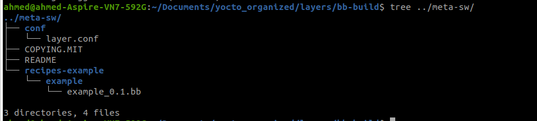

# mount rootfs over network 

it is not practical at all to reflash the root filesystem on the target everytime a change is made. so we can set the root file system to be on the network.

to do so we follow the upcomming steps

### Configure Target

we need also to check linux kernel configuration for enabling the Network file system is enabled by using   

```sh 
bitbake -c menuconfig virtual/kernel
```

check that 

- `CONFIG_NFS_FS=y`, NFS client support

- `CONFIG_IP_PNP=y`, configure IP at boot time

- `CONFIG_ROOT_NFS=y`, support for NFS as rootfs

save and force rebuild of kernel then build image core-minimal-image again: 

```sh
bitbake -c savedefconfig virtual/kernel # savedefconfig
bitbake -f virtual/kernel # run the linux build again
bitbake core-image-minimal 
```


To configure this we need to set the bootloader to pass the kernel parameters to set RFS on network as follows, in our case of raspberrypi we will change "**cmdline.txt**" on the sdcard to this value

```sh
root=/dev/nfs rw console=tty1,115200 nfsroot=192.168.0.6:/nfs ip=192.168.0.100:::::eth0
```

### Configure Host

```sh
# Install an NFS server
sudo apt install nfs-kernel-server
# add exported directory to `/etc/exports` file, with target ip as follows
/nfs 192.168.0.100(rw,no_root_squash,no_subtree_check)
# ask you NFS server to apply this new configuration (reload this file)
sudo exportfs -r
```

Root file system will be on the host machine on `/nfs`

# adding custom layer

we can add custom layers using `bitbake-layers` from inside`poky`/ 

```sh
source oe-init-build-env ../bb-build
# bitbake-layers is available now, location inside build
bitbake-layers create-layer ../meta-sw
bitbake-layers add ../meta-sw
bitbake-layers show-layers
```

> layer                 path                                      priority
> ==========================================================================
> ...
> meta-sw               /home/ahmed/Documents/yocto_organized/layers/meta-sw  6

you can navigate through meta-sw folder, `tree ../meta-sw`



we can start adding our recipes to this layer 

# adding custom application

Refer to [This link](https://github.com/ahmedhussien91/ycoto-excersise.git) for code of this layer, to start working with this layer you need to 

```sh
git clone https://github.com/ahmedhussien91/ycoto-excersise.git
cd yocto-excersise
./clone_layers
./bitbake_bb_rpi # to build the Excersise for both raspberrypi & beaglebone
```

In the upcoming sections we will see how to write a recipe for different applications using different build systems like make and cmake but first let's see how to compile using gcc

our work will be on `meta-sw/recipes-sw` folder 

### gcc

we first will try to build and install **errApp** inside `meta-sw/recipes-sw/errorApp` we will place our code inside folder `meta-sw/recipes-sw/errorApp/files/src` and create this recipe `meta-sw/recipes-sw/errorApp/error-gcc_1.0.bb`

**error-gcc_1.0.bb**

```bash
DESCRIPTION = "program that generates an error looking for file aa"
LICENSE = "CLOSED"

SRC_URI = "file://src"
S="${WORKDIR}/src"
LDFLAGS=""

do_compile(){
	#compile applicacation using gcc 
	$CC -c -g -Wall error_functions.c 
	$CC -c -g -Wall get_num.c 
	$CC -c -g -Wall main.c 
	$CC -o test error_functions.o get_num.o main.o	
}

do_install () {
	mkdir -p ${D}${bindir}
	cp ${S}/test ${D}${bindir}
	chmod -R 0777 ${D}
}
```

### Make

**error-gcc_2.0.bb** is a modified version that use make which is the default of the task `do_compile()`, and we use `install` shell command to copy to `image` folder with specific hierarchy, if the recipe is installed into image this folder will be copied to the final root file system

```sh
DESCRIPTION="test custom application"
LICENSE="CLOSED"

SRC_URI ="file://src"

S="${WORKDIR}/src"

TARGET_CC_ARCH += "${LDFLAGS}"

do_compile_append(){
	echo "working directory: $PWD"
	echo "make is called by default......."
}

do_install() {
	install -d ${D}${bindir}
	install -m 0755 test ${D}${bindir}
}
```


### CMAKE

let's try to build our [read-app](https://github.com/ahmedhussien91/posix-app) that was built using cmake. we create a recipe **readapp_1.0.bb**

```sh
DESCRIPTION = "The software is for testing, it will only print what is passed on stdin, it also has another thread that always prints" 
HOMEPAGE = "https://github.com/ahmedhussien91/posix-app"
# package category (e.g. console/utils), check http://www.embeddedlinux.org.cn/OEManual/section_variable.html
SECTION = "console" 
LICENSE = "MIT"
LIC_FILES_CHKSUM = "file://${COREBASE}/meta/files/common-licenses/MIT;md5=0835ade698e0bcf8506ecda2f7b4f302"
# LIC_FILES_CHKSUM = "file://${COMMON_LICENSE_DIR}/MIT;md5=0835ade698e0bcf8506ecda2f7b4f302"
# use if the license if on git TODO  
# LIC_FILES_CHKSUM = "file://${WORKDIR}/MIT;md5=0835ade698e0bcf8506ecda2f7b4f302" 

# point to the source on git
SRC_URI = "git://github.com/ahmedhussien91/posix-app.git;protcol=https;branch=main"
# git commit hash
SRCREV = "693c11bd4844e85f795bd4b960f842a7bdf8a75d"

# this where the code will be downloaded when it's fetched from git
S = "${WORKDIR}/git"

#inherit cmake.bbclass to configure, compile and install program using cmake
inherit cmake
```

### Libraries

We will do the same steps done in the Linux native compilation exercise compiling the `error-gcc` but using static and dynamic libraries

#### Static Libraries

for this we create also`meta-sw/recipes-libs/error-functions/get-num_1.0.bb`

```sh
DESCRIPTION = "program that generates an error looking for file aa"
LICENSE = "CLOSED"

SRC_URI = "file://src"
S="${WORKDIR}/src"
LDFLAGS=""

# compile the library `libgetnum.a` 
do_compile(){
	$CC -c -g -Wall get_num.c 
	$AR -crv libgetnum.a get_num.o
}

# install the library `libgetnum.a` and `get_num.h` file 
do_install() {
	install -d ${D}${libdir}
    install -d ${D}${includedir}
	install -m 0755 libgetnum.a ${D}${libdir}
    install -m 0755 ${WORKDIR}/src/get_num.h ${D}${includedir}
}
```


we create `meta-sw/recipes-libs/error-functions/error-functions_1.0.bb`

```sh
DESCRIPTION = "program that generates an error looking for file aa"
LICENSE = "CLOSED"

SRC_URI = "file://src"
S="${WORKDIR}/src"
LDFLAGS=""
DEPENDS = "get-num"

# compile the library `liberrorfun.a` 
do_compile(){
	$CC -c -g -Wall error_functions.c -I${STAGING_INCDIR}
	$AR -crv liberrorfun.a error_functions.o
}

# install the library `liberrorfun.a` and `error_functions.h` file 
do_install() {
	install -d ${D}${libdir}
  	install -d ${D}${includedir}
	install -m 0755 liberrorfun.a ${D}${libdir}
    install -m 0755 ${WORKDIR}/src/error_functions.h ${D}${includedir}
}

# packaging of the libraries is done automatically
```

and create `meta-sw/recipes-sw/errorApp/error-gcc_3.0.bb` to compile using those libraries

```sh
DESCRIPTION="test custom application"
LICENSE="CLOSED"

SRC_URI ="file://src"
DEPENDS = "error-functions"
S="${WORKDIR}/src"

# for QA check of Linker  
TARGET_CC_ARCH += "${LDFLAGS}"
# INSANE_SKIP_${PN} += "ldflags"
# check this for skipping QA checks https://docs.yoctoproject.org/ref-manual/classes.html#ref-classes-insane

# compile with STATIC libraries that will exist in path `STAGING_LIBDIR`
do_compile(){
	$CC -o erro-app main.c ${STAGING_LIBDIR}/libgetnum.a 	${STAGING_LIBDIR}/liberrorfun.a
}

do_install() {
	install -d ${D}${bindir}
	install -m 0755 erro-app ${D}${bindir}
}
```


#### Dynamic Libraries

for the use of dynamic libraries we created `meta-sw/recipes-libs/get-num/get-num_2.0.bb`

```sh
DESCRIPTION = "program that generates an error looking for file aa"
LICENSE = "CLOSED"

SRC_URI = "file://src"
S="${WORKDIR}/src"
LDFLAGS=""

# compile `libgetnum.so.${PV}` and set soname 
do_compile(){
	$CC -fpic -c -g -Wall get_num.c 
	$CC -shared -Wl,-soname,libgetnum.so -o libgetnum.so.${PV} get_num.o
}

# not that we used `oe_soinstall` instead of `install` 
do_install() {
	install -d ${D}${libdir}
    install -d ${D}${includedir}
	oe_soinstall libgetnum.so.${PV} ${D}${libdir}
    install -m 0755 ${WORKDIR}/src/get_num.h ${D}${includedir}
}
```

`meta-sw/recipes-libs/error-functions/error-functions_2.0.bb`

```sh
DESCRIPTION = "program that generates an error looking for file aa"
LICENSE = "CLOSED"

SRC_URI = "file://src"
S="${WORKDIR}/src"
LDFLAGS=""
DEPENDS = "get-num"
RDEPENDS_${PN} = "get-num"

do_compile(){
	$CC -c -g -Wall error_functions.c -I${STAGING_INCDIR}
	$CC -shared -Wl,-soname,liberrorfun.so -o liberrorfun.so.${PV} error_functions.o
}

do_install() {
	install -d ${D}${libdir}
	install -d ${D}${includedir}
	oe_soinstall liberrorfun.so.${PV} ${D}${libdir}
    install -m 0755 ${WORKDIR}/src/error_functions.h ${D}${includedir}
}
```

create `meta-sw/recipes-sw/errorApp/error-gcc_4.0.bb` to compile using those dynamic libraries

```sh
DESCRIPTION="test custom application"
LICENSE="CLOSED"

SRC_URI ="file://src"
DEPENDS = "error-functions"
S="${WORKDIR}/src"


TARGET_CC_ARCH += "${LDFLAGS}"

# compile with shared libraries, including `STAGING_LIBDIR`
do_compile(){
	$CC -o erro-app main.c -L${STAGING_LIBDIR} -lgetnum -lerrorfun
}

do_install() {
	install -d ${D}${bindir}
	install -m 0755 erro-app ${D}${bindir}
}
```


### Qt

TODO


# Updating Application Recipes to use systemV and Systemd

create `meta-sw/recipes-sw/errorApp/error-gcc_5.0.bb` to compile using those dynamic libraries

```sh
DESCRIPTION="test custom application"
LICENSE="CLOSED"

SRC_URI ="file://src"
DEPENDS = "error-functions"
S="${WORKDIR}/src"

inherit  update-rc.d systemd

TARGET_CC_ARCH += "${LDFLAGS}"

# compile with shared libraries, including `STAGING_LIBDIR`
do_compile(){
	$CC -o erro-app main.c -L${STAGING_LIBDIR} -lgetnum -lerrorfun
}

do_install() {
	install -d ${D}${bindir}
	install -m 0755 erro-app ${D}${bindir}
	# install systemv init scripts
	install -d ${D}${sysconfdir}/init.d
	install -c -m 755 error-app.sh ${D}${sysconfdir}/init.d/error-app.sh
	# install systemd init scripts
	install -d ${D}${systemd_unitdir}/system
	install -m 0644 error-app.service ${D}${systemd_unitdir}/system
}

INITSCRIPT_NAME_${PN} = "error-app.sh"
INITSCRIPT_PARAMS_${PN} = "defaults"
#INITSCRIPT_PARAMS_${PN} = "start 99 5 2 . stop 20 0 1 6 ."
SYSTEMD_SERVICE_${PN} = "error-app.service"
```

we have also to implement the two files `error-app.sh` and `error-app.service` scripts and put in file `meta-sw/recipes-sw/error-app/files/src`

**error-app.sh**

```sh
#! /bin/sh
case "$1" in
      start)
           echo "Starting readapp........."
           start-stop-daemon -S -n readapp -a /usr/bin/erro-app &
           ;;
     stop)
           echo "Stopping readapp........."
           start-stop-daemon -K -n erro-app
           ;;
     *)
           echo "Usage: $0 {start|stop}"
           exit 1
esac
exit 0
```

**error-app.service**

```sh
[Unit]
Description=erro-app server
[Service]
Type=simple
ExecStart=/usr/bin/erro-app

[Install]
WantedBy=multi-user.target
```


you can insert multiple init scripts using `INITSCRIPT_PACKAGES` like the following Example

```sh
INITSCRIPT_PACKAGES = "${PN}-httpd ${PN}-ftpd"
INITSCRIPT_NAME_${PN}-httpd = "httpd.sh"
INITSCRIPT_NAME_${PN}-ftpd = "ftpd.sh"
INITSCRIPT_PARAMS_${PN}-httpd = "defaults"
INITSCRIPT_PARAMS_${PN}-ftpd = "start 99 5 2 . stop 20 0 1 6 ."
#look `busybox.inc`
```

 

# Creating custom image

We need to create our custom image to include our applications by default instead of putting everything in the `local.conf` file to do so inside `meta-sw/` we:

```sh
mkdir -p recipes-core/images
cd recipes-core/images
cp ../../../poky/meta/recipes-core/images/core-image-base.bb custom-image.inc
```

we will use the `core-image-base.bb` as base for our images, then we impelement the following two custom images:

**custom-image-sysv.bb**

```sh
include custom-image.inc

IMAGE_INSTALL_append = " openssh \
						 error-gcc \
						 read-app \
						 "
IMAGE_FSTYPES_append = " tar"

# PREFERRED_VERSION_error-gcc = "1.0"
```

**custom-image-sysd.bb**

```sh
include custom-image.inc

IMAGE_INSTALL_append = " openssh \
						 error-gcc \
						 read-app \
						 "
IMAGE_FSTYPES_append = " tar"

# PREFERRED_VERSION_error-gcc = "1.0"

# add systemd support
# add systemd to distro features
DISTRO_FEATURES_append = " systemd"   
# remove the systemv from distro features
DISTRO_FEATURES_BACKFILL_CONSIDERED += "sysvinit" 
# assign init_manager as systemd
VIRTUAL-RUNTIME_init_manager = "systemd" 
# assign initscripts to systemd-compact-units, allow us to use `systemctl`
VIRTUAL-RUNTIME_initscripts = "systemd-compat-units" 
```


# Features

please refer to [yocto Features Documentation link](https://docs.yoctoproject.org/3.2.3/ref-manual/ref-features.html): provides a reference of shipped machine and distro features you can include as part of your image, a reference on image features you can select, and a reference on feature backfilling.

## Introduction

Distributions can select which features they want to support through the `DISTRO_FEATURES` variable, usually appended in distribution configuration file, such as **poky.conf**

Machine features are set in the `MACHINE_FEATURES` variable, which is set in the machine configuration file and specifies the hardware features for a given machine.

These two variables combine to work out which **kernel modules**, **utilities**, and **other packages** to include. 

A given distribution can support a selected subset of features so some machine features might not be included if the distribution itself does not support them.

To determine see recipes that check if features exists or not to act on this value you can do

```sh
grep -r --exclude-dir=build*  'contains.*MACHINE_FEATURES.*' .
```

> ./poky/meta/recipes-kernel/linux/linux-yocto.inc:KERNEL_FEATURES_append = " ${@bb.utils.contains('MACHINE_FEATURES', 'numa', 'features/numa/numa.scc', '', d)}"
> ./poky/meta/recipes-extended/packagegroups/packagegroup-core-base-utils.bb:    ${@bb.utils.contains("MACHINE_FEATURES", "keyboard", "kbd", "", d)} \
> ./poky/meta/recipes-devtools/qemu/qemuwrapper-cross_1.0.bb:if [ ${@bb.utils.contains('MACHINE_FEATURES', 'qemu-usermode', 'True', 'False', d)} = False -a "${PN}" != "nativesdk-qemuwrapper-cross" ]; then
> ./poky/meta/recipes-devtools/python/python3_3.8.13.bb:    if bb.utils.contains('MACHINE_FEATURES', 'qemu-usermode', True, False, d) and d.getVar('BUILD_REPRODUCIBLE_BINARIES') != '1':
> ./poky/meta/recipes-core/packagegroups/packagegroup-base.bb:            ${@bb.utils.contains("MACHINE_FEATURES", "acpi", "packagegroup-base-acpi", "",d)} \
> ./poky/meta/recipes-core/packagegroups/packagegroup-base.bb:            ${@bb.utils.contains("MACHINE_FEATURES", "alsa", "packagegroup-base-alsa", "", d)} \
> ./poky/meta/recipes-core/packagegroups/packagegroup-base.bb:            ${@bb.utils.contains("MACHINE_FEATURES", "apm", "packagegroup-base-apm", "", d)} \
> ./poky/meta/recipes-core/packagegroups/packagegroup-base.bb:            ${@bb.utils.contains("MACHINE_FEATURES", "ext2", "packagegroup-base-ext2", "", d)} \
> ./poky/meta/recipes-core/packagegroups/packagegroup-base.bb:            ${@bb.utils.contains("MACHINE_FEATURES", "vfat", "packagegroup-base-vfat", "", d)} \
> ./poky/meta/recipes-core/packagegroups/packagegroup-base.bb:            ${@bb.utils.contains("MACHINE_FEATURES", "keyboard", "packagegroup-base-keyboard", "", d)} \
> ./poky/meta/recipes-core/packagegroups/packagegroup-base.bb:            ${@bb.utils.contains("MACHINE_FEATURES", "pci", "packagegroup-base-pci", "",d)} \
> ./poky/meta/recipes-core/packagegroups/packagegroup-base.bb:            ${@bb.utils.contains("MACHINE_FEATURES", "pcmcia", "packagegroup-base-pcmcia", "", d)} \
> ./poky/meta/recipes-core/packagegroups/packagegroup-base.bb:            ${@bb.utils.contains("MACHINE_FEATURES", "phone", "packagegroup-base-phone", "", d)} \
> ./poky/meta/recipes-core/packagegroups/packagegroup-base.bb:            ${@bb.utils.contains("MACHINE_FEATURES", "serial", "packagegroup-base-serial", "", d)} \
> ./poky/meta/recipes-core/packagegroups/packagegroup-base.bb:            ${@bb.utils.contains("MACHINE_FEATURES", "usbgadget", "packagegroup-base-usbgadget", "", d)} \
> ./poky/meta/recipes-core/packagegroups/packagegroup-base.bb:            ${@bb.utils.contains("MACHINE_FEATURES", "usbhost", "packagegroup-base-usbhost", "", d)} \
> ./poky/meta/recipes-core/packagegroups/packagegroup-base.bb:    ${@bb.utils.contains('MACHINE_FEATURES', 'apm', 'packagegroup-base-apm', '',d)} \
> ./poky/meta/recipes-core/packagegroups/packagegroup-base.bb:    ${@bb.utils.contains('MACHINE_FEATURES', 'acpi', 'packagegroup-base-acpi', '',d)} \
> ./poky/meta/recipes-core/packagegroups/packagegroup-base.bb:    ${@bb.utils.contains('MACHINE_FEATURES', 'keyboard', 'packagegroup-base-keyboard', '',d)} \
> ./poky/meta/recipes-core/packagegroups/packagegroup-base.bb:    ${@bb.utils.contains('MACHINE_FEATURES', 'phone', 'packagegroup-base-phone', '',d)} \
> ./poky/meta/recipes-core/packagegroups/packagegroup-core-boot.bb:SYSVINIT_SCRIPTS = "${@bb.utils.contains('MACHINE_FEATURES', 'rtc', '${VIRTUAL-RUNTIME_base-utils-hwclock}', '', d)} \
> ./poky/meta/recipes-core/packagegroups/packagegroup-core-boot.bb:    ${@bb.utils.contains("MACHINE_FEATURES", "keyboard", "${VIRTUAL-RUNTIME_keymaps}", "", d)} \
> ./poky/meta/recipes-core/packagegroups/packagegroup-core-boot.bb:    ${@bb.utils.contains("MACHINE_FEATURES", "efi", "${EFI_PROVIDER} kernel", "", d)} \
> ./poky/meta/classes/gtk-doc.bbclass:                      bb.utils.contains('MACHINE_FEATURES', 'qemu-usermode', 'True', 'False', d), 'False', d)}"
> ./poky/meta/classes/manpages.bbclass:			if ${@bb.utils.contains('MACHINE_FEATURES', 'qemu-usermode', 'true','false', d)}; then
> ./poky/meta/classes/live-vm-common.bbclass:EFI = "${@bb.utils.contains("MACHINE_FEATURES", "efi", "1", "0", d)}"
> ./poky/meta/classes/live-vm-common.bbclass:EFI_CLASS = "${@bb.utils.contains("MACHINE_FEATURES", "efi", "${EFI_PROVIDER}", "", d)}"
> ./poky/meta/classes/live-vm-common.bbclass:    pcbios = bb.utils.contains("MACHINE_FEATURES", "pcbios", "1", "0", d)
> ./poky/meta/classes/live-vm-common.bbclass:        pcbios = bb.utils.contains("MACHINE_FEATURES", "efi", "0", "1", d)
> ./poky/meta/classes/gobject-introspection-data.bbclass:                      bb.utils.contains('MACHINE_FEATURES', 'qemu-usermode', 'True', 'False', d), 'False', d)}"
> ./poky/meta/recipes-sato/webkit/libwpe_1.4.0.1.bb:CFLAGS_append_rpi = " ${@bb.utils.contains('MACHINE_FEATURES', 'vc4graphics', '', '-D_GNU_SOURCE', d)}"
> ./poky/meta/recipes-sato/matchbox-panel-2/matchbox-panel-2_2.11.bb:DEPENDS += " ${@bb.utils.contains("MACHINE_FEATURES", "acpi", "libacpi", "",d)}"
> ./poky/meta/recipes-sato/matchbox-panel-2/matchbox-panel-2_2.11.bb:DEPENDS += " ${@bb.utils.contains("MACHINE_FEATURES", "apm", "apmd", "",d)}"
> ./poky/meta/recipes-sato/matchbox-panel-2/matchbox-panel-2_2.11.bb:EXTRA_OECONF += " ${@bb.utils.contains("MACHINE_FEATURES", "acpi", "--with-battery=acpi", "",d)}"
> ./poky/meta/recipes-sato/matchbox-panel-2/matchbox-panel-2_2.11.bb:EXTRA_OECONF += " ${@bb.utils.contains("MACHINE_FEATURES", "apm", "--with-battery=apm", "",d)}"
> ./poky/documentation/ref-manual/ref-features.rst:   $ git grep 'contains.*MACHINE_FEATURES.*feature'
> ./meta-raspberrypi/recipes-kernel/linux/linux-raspberrypi.inc:KERNEL_MODULE_AUTOLOAD += "${@bb.utils.contains("MACHINE_FEATURES", "pitft28r", "stmpe-ts", "", d)}"
> ./meta-raspberrypi/recipes-kernel/linux/linux-raspberrypi.inc:    VC4GRAPHICS="${@bb.utils.contains("MACHINE_FEATURES", "vc4graphics", "1", "0", d)}"
> ./meta-raspberrypi/recipes-kernel/linux/linux-raspberrypi.inc:        PITFT="${@bb.utils.contains("MACHINE_FEATURES", "pitft", "1", "0", d)}"
> ./meta-raspberrypi/dynamic-layers/qt5-layer/recipes-qt/qt5/qtbase_%.bbappend:PACKAGECONFIG_GL_append_rpi = "${@bb.utils.contains('MACHINE_FEATURES', 'vc4graphics', ' kms', '', d)}"
> ./meta-raspberrypi/dynamic-layers/qt5-layer/recipes-qt/qt5/qtbase_%.bbappend:OE_QTBASE_EGLFS_DEVICE_INTEGRATION_rpi = "${@bb.utils.contains('MACHINE_FEATURES', 'vc4graphics', '', 'eglfs_brcm', d)}"
> ./meta-raspberrypi/dynamic-layers/qt5-layer/recipes-qt/qt5/qtbase_%.bbappend:RDEPENDS_${PN}_append_rpi = "${@bb.utils.contains('MACHINE_FEATURES', 'vc4graphics', '', ' userland', d)}"
> ./meta-raspberrypi/dynamic-layers/qt5-layer/recipes-qt/qt5/qtbase_%.bbappend:DEPENDS_append_rpi = "${@bb.utils.contains('MACHINE_FEATURES', 'vc4graphics', '', ' userland', d)}"
> ./meta-raspberrypi/recipes-graphics/kmscube/kmscube_%.bbappend:COMPATIBLE_HOST_rpi = "${@bb.utils.contains('MACHINE_FEATURES', 'vc4graphics', '(.*)', 'null', d)}"
> ./meta-raspberrypi/recipes-graphics/userland/userland_git.bb:PROVIDES += "${@bb.utils.contains("MACHINE_FEATURES", "vc4graphics", "", "virtual/libgles2 virtual/egl", d)}"
> ./meta-raspberrypi/recipes-graphics/userland/userland_git.bb:RPROVIDES_${PN} += "${@bb.utils.contains("MACHINE_FEATURES", "vc4graphics", "", "libgles2 egl libegl libegl1 libglesv2-2", d)}"
> ./meta-raspberrypi/recipes-graphics/userland/userland_git.bb:	if [ "${@bb.utils.contains("MACHINE_FEATURES", "vc4graphics", "1", "0", d)}" = "1" ]; then
> ./meta-raspberrypi/recipes-graphics/userland/userland_git.bb:RDEPENDS_${PN} += "${@bb.utils.contains("MACHINE_FEATURES", "vc4graphics", "libegl-mesa", "", d)}"
> ./meta-raspberrypi/recipes-graphics/mesa/mesa-demos_%.bbappend:COMPATIBLE_HOST_rpi = "${@bb.utils.contains('MACHINE_FEATURES', 'vc4graphics', '(.*)', 'null', d)}"
> ./meta-raspberrypi/recipes-graphics/cairo/cairo_%.bbappend:PACKAGECONFIG_append_rpi = "${@bb.utils.contains('MACHINE_FEATURES', 'vc4graphics', '', ' egl ${PACKAGECONFIG_GLESV2}', d)}"
> ./meta-raspberrypi/recipes-graphics/xorg-xserver/xserver-xorg_%.bbappend:OPENGL_PKGCONFIGS_rpi = "dri glx ${@bb.utils.contains('MACHINE_FEATURES', 'vc4graphics', 'dri3 xshmfence glamor', '', d)}"
> ./meta-raspberrypi/recipes-graphics/xorg-xserver/xserver-xorg_%.bbappend:DEPENDS_append_rpi = " ${@bb.utils.contains('MACHINE_FEATURES', 'vc4graphics', '', 'userland', d)}"
> ./meta-raspberrypi/recipes-graphics/xorg-xserver/xserver-xf86-config_%.bbappend:    PITFT="${@bb.utils.contains("MACHINE_FEATURES", "pitft", "1", "0", d)}"
> ./meta-raspberrypi/recipes-graphics/wayland/weston_%.bbappend:PACKAGECONFIG_remove_rpi = "${@bb.utils.contains('MACHINE_FEATURES', 'vc4graphics', 'fbdev', '', d)}"
> ./meta-raspberrypi/recipes-graphics/wayland/weston_%.bbappend:    ${@bb.utils.contains('MACHINE_FEATURES', 'vc4graphics', '', ' \
> ./meta-raspberrypi/recipes-graphics/wayland/wayland_%.bbappend:    if [ "${@bb.utils.contains("MACHINE_FEATURES", "vc4graphics", "1", "0", d)}" = "0" ]; then
> ./meta-raspberrypi/recipes-graphics/piglit/piglit_%.bbappend:RDEPENDS_${PN}_remove_rpi = "${@bb.utils.contains('MACHINE_FEATURES', 'vc4graphics', '', 'mesa-demos', d)}"
> ./meta-raspberrypi/recipes-graphics/piglit/piglit_%.bbappend:COMPATIBLE_HOST_rpi = "${@bb.utils.contains('MACHINE_FEATURES', 'vc4graphics', '(.*)', 'null', d)}"
> ./meta-raspberrypi/recipes-graphics/libsdl2/libsdl2_%.bbappend:DEPENDS_append_rpi = " ${@bb.utils.contains('MACHINE_FEATURES', 'vc4graphics', '', 'userland', d)}"
> ./meta-raspberrypi/recipes-graphics/libva/libva_%.bbappend:DEPENDS_append_rpi = " ${@bb.utils.contains('MACHINE_FEATURES', 'vc4graphics', '', 'userland', d)}"
> ./meta-raspberrypi/recipes-core/packagegroups/packagegroup-rpi-test.bb:OMXPLAYER  = "${@bb.utils.contains('MACHINE_FEATURES', 'vc4graphics', '', 'omxplayer', d)}"
> ./meta-raspberrypi/recipes-core/packagegroups/packagegroup-core-tools-testapps.bbappend:X11GLTOOLS_remove_rpi = "${@bb.utils.contains('MACHINE_FEATURES', 'vc4graphics', '', 'mesa-demos', d)}"
> ./meta-raspberrypi/classes/sdcard_image-rpi.bbclass:    ${@bb.utils.contains('MACHINE_FEATURES', 'armstub', 'armstubs:do_deploy', '' ,d)} \
> ./meta-raspberrypi/classes/sdcard_image-rpi.bbclass:    if [ "${@bb.utils.contains("MACHINE_FEATURES", "armstub", "1", "0", d)}" = "1" ]; then
> ./meta-raspberrypi/recipes-multimedia/gstreamer/gstreamer1.0-plugins-base_%.bbappend:PACKAGECONFIG_append_rpi = "${@bb.utils.contains('MACHINE_FEATURES', 'vc4graphics', '', ' dispmanx', d)}"
> ./meta-raspberrypi/recipes-multimedia/gstreamer/gstreamer1.0-plugins-base_%.bbappend:DEPENDS_append_rpi = "${@bb.utils.contains('MACHINE_FEATURES', 'vc4graphics', '', ' userland', d)}"
> ./meta-raspberrypi/recipes-multimedia/gstreamer/gstreamer1.0-plugins-base_%.bbappend:PACKAGECONFIG_GL_rpi = "${@bb.utils.contains('MACHINE_FEATURES', 'vc4graphics', '${PACKAGECONFIG_GL_VC4GRAPHICS}', 'egl gles2', d)}"
> ./meta-raspberrypi/recipes-multimedia/omxplayer/omxplayer_git.bb:SRC_URI_append = "${@bb.utils.contains("MACHINE_FEATURES", "vc4graphics", " file://0001-Fix-build-with-vc4-driver.patch ", "", d)}"
> ./meta-raspberrypi/recipes-multimedia/omxplayer/omxplayer_git.bb:export INCLUDES = "${@bb.utils.contains("MACHINE_FEATURES", "vc4graphics", " -D__GBM__", "", d)} \
> ./meta-raspberrypi/conf/machine/include/rpi-base.inc:    ${@bb.utils.contains("MACHINE_FEATURES", "vc4graphics", "xserver-xorg-extension-glx", "", d)} \
> ./meta-raspberrypi/conf/machine/include/rpi-base.inc:    ${@bb.utils.contains("MACHINE_FEATURES", "vc4graphics", "xf86-video-modesetting", "xf86-video-fbdev", d)} \
> ./meta-raspberrypi/conf/machine/include/rpi-default-providers.inc:PREFERRED_PROVIDER_virtual/egl ?= "${@bb.utils.contains("MACHINE_FEATURES", "vc4graphics", "mesa", "userland", d)}"
> ./meta-raspberrypi/conf/machine/include/rpi-default-providers.inc:PREFERRED_PROVIDER_virtual/libgles2 ?= "${@bb.utils.contains("MACHINE_FEATURES", "vc4graphics", "mesa", "userland", d)}"
> ./meta-raspberrypi/conf/machine/include/rpi-default-providers.inc:PREFERRED_PROVIDER_virtual/libgl ?= "${@bb.utils.contains("MACHINE_FEATURES", "vc4graphics", "mesa", "mesa-gl", d)}"
> ./meta-raspberrypi/conf/machine/include/rpi-default-providers.inc:PREFERRED_PROVIDER_virtual/mesa ?= "${@bb.utils.contains("MACHINE_FEATURES", "vc4graphics", "mesa", "mesa-gl", d)}"
> ./meta-raspberrypi/conf/machine/include/rpi-default-providers.inc:PREFERRED_PROVIDER_virtual/libgbm ?= "${@bb.utils.contains("MACHINE_FEATURES", "vc4graphics", "mesa", "mesa-gl", d)}"
> ./meta-raspberrypi/recipes-bsp/bootfiles/rpi-config_git.bb:PITFT="${@bb.utils.contains("MACHINE_FEATURES", "pitft", "1", "0", d)}"
> ./meta-raspberrypi/recipes-bsp/bootfiles/rpi-config_git.bb:PITFT22="${@bb.utils.contains("MACHINE_FEATURES", "pitft22", "1", "0", d)}"
> ./meta-raspberrypi/recipes-bsp/bootfiles/rpi-config_git.bb:PITFT28r="${@bb.utils.contains("MACHINE_FEATURES", "pitft28r", "1", "0", d)}"
> ./meta-raspberrypi/recipes-bsp/bootfiles/rpi-config_git.bb:PITFT28c="${@bb.utils.contains("MACHINE_FEATURES", "pitft28c", "1", "0", d)}"
> ./meta-raspberrypi/recipes-bsp/bootfiles/rpi-config_git.bb:PITFT35r="${@bb.utils.contains("MACHINE_FEATURES", "pitft35r", "1", "0", d)}"
> ./meta-raspberrypi/recipes-bsp/bootfiles/rpi-config_git.bb:VC4GRAPHICS="${@bb.utils.contains("MACHINE_FEATURES", "vc4graphics", "1", "0", d)}"
> ./meta-raspberrypi/recipes-bsp/bootfiles/rpi-config_git.bb:    if [ "${@bb.utils.contains("MACHINE_FEATURES", "armstub", "1", "0", d)}" = "1" ]; then

let's trace 'wifi' feature

```sh
grep -r --exclude-dir=build*  '.*contains.*MACHINE_FEATURES.*' .  | grep wifi # NO wifi as a machine feature
grep -r --exclude-dir=build*  '.*contains.*DISTRO_FEATURES.*' .  | grep wifi 
```

> ./poky/meta/recipes-core/systemd/systemd_244.5.bb:    ${@bb.utils.contains('DISTRO_FEATURES', 'wifi', 'rfkill', '', d)} \
> ./poky/meta/recipes-core/packagegroups/packagegroup-base.bb:            ${@bb.utils.contains("DISTRO_FEATURES", "wifi", "packagegroup-base-wifi", "", d)} \
> ./poky/meta/recipes-core/packagegroups/packagegroup-base.bb:    ${@bb.utils.contains('DISTRO_FEATURES', 'wifi', 'kernel-module-hostap-cs', '',d)} \
> ./poky/meta/recipes-core/packagegroups/packagegroup-base.bb:    ${@bb.utils.contains('DISTRO_FEATURES', 'wifi', 'kernel-module-orinoco-cs', '',d)} \
> ./poky/meta/recipes-core/packagegroups/packagegroup-base.bb:    ${@bb.utils.contains('DISTRO_FEATURES', 'wifi', 'kernel-module-spectrum-cs', '',d)}"
> ./poky/meta/recipes-core/busybox/busybox.inc:    busybox_cfg(bb.utils.contains_any('DISTRO_FEATURES', 'bluetooth wifi', True, False, d), 'CONFIG_RFKILL', cnf, rem)
> grep: ./poky/meta/recipes-connectivity/nfs-utils/.nfs-utils_2.4.3.bb.swp: binary file matches
> ./poky/meta/recipes-connectivity/neard/neard_0.16.bb:                     ${@bb.utils.contains('DISTRO_FEATURES', 'wifi','wpa-supplicant', '', d)} \
> grep: ./poky/meta/lib/oe/__pycache__/utils.cpython-310.pyc: binary file matches

**Note:** @bb.utils.contains('DISTRO_FEATURES', 'wifi', 'kernel-module-spectrum-cs', '',d) mean:

- `@` mean that the upcomming is a python code 
- `bb.utils.contains` it's definition is in `poky/bitbake/lib/bb/utils.py`
- function `contains`: `def contains(variable, checkvalues, truevalue, falsevalue, d)`
  - check if **checkvalues** is a subset of the variable string
  - return **truevalue** if true return **falsevalue** otherwise
  - **d** data store

  you will note that `packagegroup-base.bb` mentions the wifi multiple times let's explore this 

# optimizing your image

this is an answer to a stackoverflow question ([link](https://stackoverflow.com/questions/28765494/yocto-minimal-image-with-package-management)) 

I can suggest you few things, which may help you to optimize size of rootfs:

- Optimize as much as possible linux kernel binary and removed unnecessary packages (filesystem,device driver,networking etc).

  ```
  $ bitbake -c menuconfig virtual/kernel //configure as per your requirement
  $ bitbake -c savedefconfig virtual/kernel //savedefconfig
  $ bitbake -f virtual/kernel
  ```

- Configure Busybox and removed unused things:

  ```
  $ bitbake -c menuconfig busybox
  ```

- Remove those Distro features if not in use (and check more also): graphics [x11], sound [alsa], touchscreen [touchscreen], Multimedia. Change apply in `conf/local.conf` file. Example: `DISTRO_FEATURES_remove = "x11 alsa touchscreen bluetooth opengl wayland "`

- Choose proper system init manager: systemd or sysvinit

- Removed Unused Packages from the image. Example `PACKAGE_EXCLUDE = "perl5 sqlite3 udev-hwdb bluez3 bluez4"`

- For small embedded device preferred `PACKAGE_CLASSES = "package_ipk"` and it is well optimized for small systems.

 
