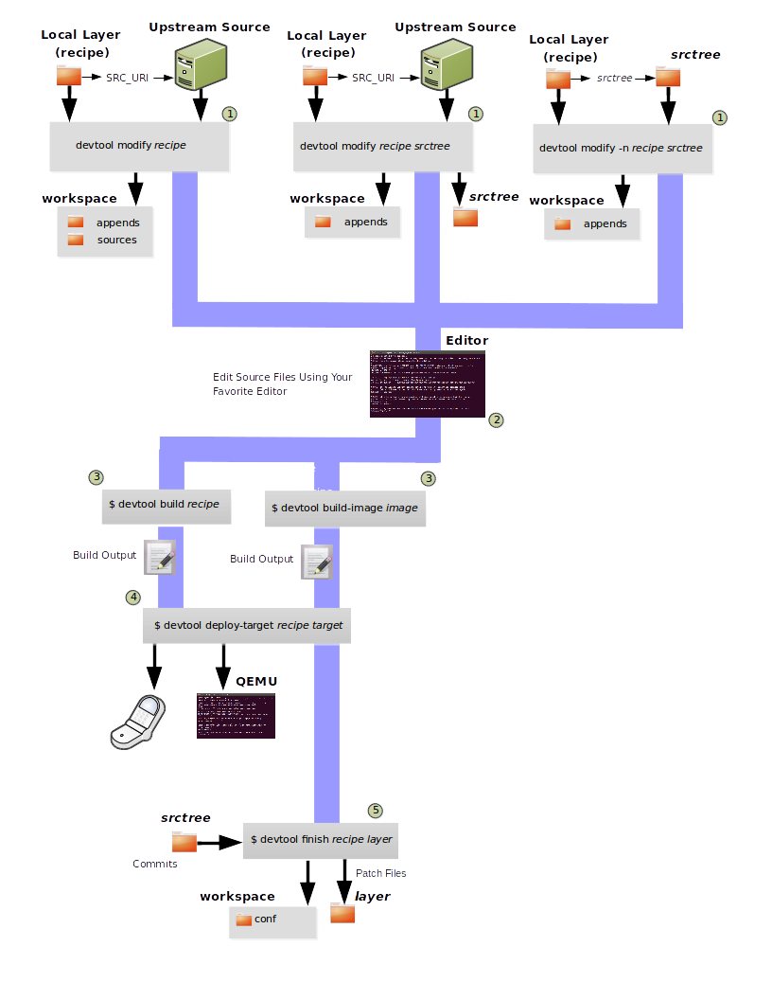
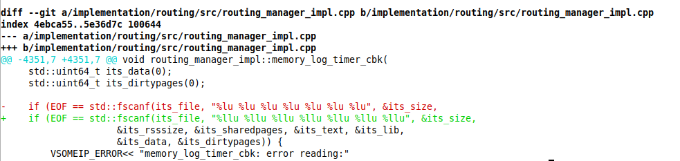
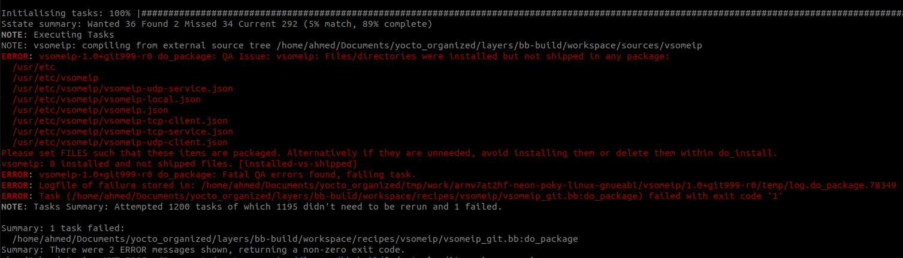

# devtools

[devtools youtube](https://www.youtube.com/watch?v=CiD7rB35CRE) 

[devtools quick referance](https://docs.yoctoproject.org/dunfell/ref-manual/ref-devtool-reference.html?highlight=devtools)

[using the extensible SDK](https://bootlin.com/~mike/pub/yocto-project/docs-2021-01-19/sdk-manual/extensible.html)  



# Exercise 

**building [vsomeip](https://github.com/COVESA/vsomeip.git) using devtoos**

from `./poky`

```sh
source oe-init-build-env ../bb-build
devtool add vsomeip https://github.com/COVESA/vsomeip.git
```

> ...
>
> INFO: Recipe /home/ahmed/Documents/yocto_organized/layers/bb-build/workspace/recipes/vsomeip/vsomeip_git.bb has been automatically created; further editing may be required to make it fully functional

to **Edit** the recipe we execute

```sh
devtool edit-recipe vsomeip
```

to **build** the recipe we execute:

```sh
devtool build vsomeip
```

compilation error, this change is needed

 

do this change and commit like done in the previous image

then execute:

```sh
devtool build vsomeip # to compile again
```

output



we need to add variable files to specific package as bitbake don't know in which package those files are to be placed, to **edit recipe**

```sh
devtool edit-recipe vsomeip
```

add this line to recipe 

```sh
# add files to vsomeip package 
FILES_${PN} += "/usr/etc \
  /usr/etc/vsomeip \
  /usr/etc/vsomeip/vsomeip-udp-service.json \
  /usr/etc/vsomeip/vsomeip-local.json \
  /usr/etc/vsomeip/vsomeip.json \
  /usr/etc/vsomeip/vsomeip-tcp-client.json \
  /usr/etc/vsomeip/vsomeip-tcp-service.json \
  /usr/etc/vsomeip/vsomeip-udp-client.json \
"
```

to update the recipe with the change we added in code

```sh
devtool update-recipe vsomeip
```

it will add this line to the recipe `file://0001-fix-compilation-error.patch \`

**created the patch** and **added it to the recipe** **:)**


to **deploy** to the target if you have **SSH server**

```sh
devtool deploy-target vsomeip root@192.168.7.1:/bin
```


after testing to include this recipe in `meta-sw` layer we:

```sh
devtool finish vsomeip meta-sw
```

> ...
>
> INFO: Updating patch 0001-fix-compilation-error.patch
> INFO: Moving recipe file to /home/ahmed/Documents/yocto_organized/layers/meta-sw/recipes-vsomeip/vsomeip
> INFO: Leaving source tree /home/ahmed/Documents/yocto_organized/layers/bb-build/workspace/sources/vsomeip as-is; if you no longer need it then please delete it manually