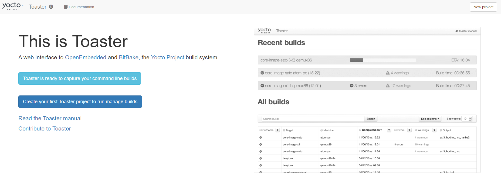

# Intro

This info is mainly prepared from this **[Embedded Linux Development Using Yocto Project Cookbook - Second Edition](https://learning.oreilly.com/library/view/embedded-linux-development/9781788399210/)** 

Toster is a web interface to the Yocto project build system.

It's built using Django framework.

It allows you to:

- Manage Layers
- Set Configuration variables
- configure local or remote builds
- start build
- See the final output of the build ->  
  - images, 
  - packages installed, 
  - build variable values, 
  - build statistics
- See recipes, packages and task dependencies

# work with Toster

## Install perquisites

```sh
sudo apt-get install python3-pip
pip3 install --user -r /opt/yocto/poky/bitbake/toaster-requirements.txt
```


## Start Toster

```sh
cd /opt/yocto/poky
source oe-init-build-env
source toaster start 
```

`/opt/yocto/poky/bitbake/bin/toaste` is a shell script that will set up Toaster's environment

- it loads the default configuration and database migrations
- Connect to the OpenEmbedded Layer Index, and download information about the metadata layers it has available for the current release,
- It starts the web server and the run builds poller process.

to access web interface you in you browser go to http://127.0.0.1:8000

you can also specify the ip and port to access it remotely using

```sh
# source toaster start webport=<IP>:<PORT>, Ex.
source toaster start webport=192.168.1.3:8001 
```

### admin interface 

you can access admin interface from http://127.0.0.1:8000/admin to **configure Toster**

but you need first to create a superuser as:

```sh
cd /opt/yocto/poky/build
../bitbake/lib/toaster/manage.py createsuperuser  
```


# Exercise (TOSTER + CRPOS)

## Install for Linux 

```sh
curl -fsSL https://download.docker.com/linux/ubuntu/gpg | sudo apt-key add -
sudo add-apt-repository "deb [arch=amd64] https://download.docker.com/linux/ubuntu $(lsb_release -cs) stable"
sudo apt-get update
sudo apt-get install docker-ce
sudo usermod -aG docker ${USER}
su - ${USER}
docker run hello-world
```

for window **[Install Docker](https://docs.docker.com/desktop/install/windows-install/)**

## work with toster on docker

Docker Images of yocto and Toster can be found **[here](https://hub.docker.com/u/crops)**

```sh
mkdir /opt/docker-toster
docker run -it --rm -p 127.0.0.1:18000:8000 -v /opt/docker-toster:/workdir crops/toaster
# on windows from `wsl` run
# docker run -it --rm -p 127.0.0.1:18000:8000 -v /mnt/d/OneDrive/Documents/corps/docker-toster:/workdir crops/toaster
# to access root user 
# docker exec -it -u 0 <container id> bash
```

now Toster will be up on  http://127.0.0.1:18000



we can try to create our first project from there

click on **create your first Toaster project to run manage builds** and start playing with Toaster

you can build your first image by specifying the image name in here 


check [Toaster Documentation](https://docs.yoctoproject.org/toaster-manual/setup-and-use.html#setting-up-and-using-toaster)

# work with yocto on Docker

```sh
docker run -it -p 127.0.0.1:18001:8000 -name poky_cnt -v G:/yocto:/yocto crops/poky # will create the container from image
# to get root access 
docker exec -it -u 0 poky_cnt bash
# to start container 
docker container start poky_cnt
# to attach container 
docker container attach poky_cnt
```

## working inside container

```sh
git 
```


# LINKS

- Django documentation can be accessed at [https://docs.djangoproject.com/en/1.](https://docs.djangoproject.com/en/1.9/)[9](https://docs.djangoproject.com/en/1.9/)[/](https://docs.djangoproject.com/en/1.9/)

- The Django management command available at toaster/manage.py is documented as part of the Django documentation at [https://docs.djangoproject.com/en/1.](https://docs.djangoproject.com/en/1.9/ref/django-admin/)[9](https://docs.djangoproject.com/en/1.9/ref/django-admin/)[/ref/django-admin/](https://docs.djangoproject.com/en/1.9/ref/django-admin/)

- Docker specific documentation can be accessed at https://docs.docker.com/engine/reference/commandline/dockerd/

- The Toaster docker container home page is https://github.com/crops/toaster-container

  