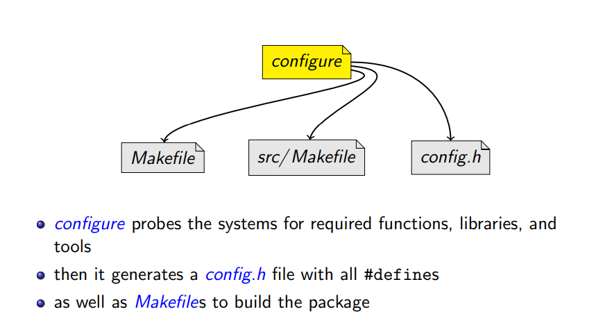
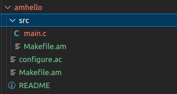
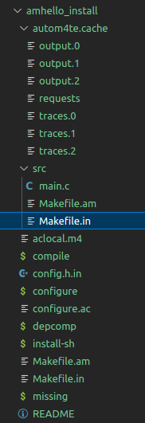

# GNU Auto Tools

main goals of Autotools is: 

- portable packages
- uniform builds

### portable packages

Consider C functions... 

- that do not exist everywhere (e.g., strtod()) 
- that have different names (e.g., strchr() vs. index()) 
- that have varying prototypes (e.g., int setpgrp(void); vs. int setpgrp(int, int);) 
- that can behave differently (e.g., malloc(0);) 
- that might require other libraries (is pow() in libm.so or in libc.so?) 
- that can be defined in different headers (string.h vs. strings.h vs. memory.h) 

How should a package deal with those?

solutions:

- slice code to alot of #if /#else, Excerpt of ffcall-1.10’s alloc_trampoline()

  ```c
  #if !defined (CODE_EXECUTABLE)
  static longpagesize = 0 ;
  #if defined(EXECUTABLE VIA MMAP DEVZERO)
  static int zero_fd;
  #endif
  if (! pagesize) {
  #if defined (HAVE_MACH_VM)
      pagesize = vm_page_size ;
  #else
      pagesize = getpagesize( );
  #endif
  #if defined (EXECUTABLE_VIA_MMAP_DEVZERO)
      zero_fd = open ( ”/dev/zero” , O_RDONLY, 0644) ;
      if ( zero_fd < 0) {
      fprintf(stderr , ”trampoline : Cannot open /dev/zero ! \ n”) ;
      abort ( ) ;
  }
  #endif
  }
  #endif
  ```

- Create substitution macros

  ```c
  #if ! HAVE_FSEEKO && ! defined fseeko
  #define fseeko(s, o, w) ((o) == (long)(o)? fseek(s, o, w):(errno = EOVERFLOW, −1))
  #endif
  ```
  
  

- Create substitution functions

  ​	If strdup() does not exist, link your program with a replacement definition such as

  ```c
  char ∗
  strdup(const char ∗ s)
  {
  size_t len = strlen(s) + 1;
  void ∗new = malloc(len) ;
  if (new == NULL)
    return NULL;
  return (char ∗) memcpy (new, s, len) ;
  }
  ```

  

### Uniform Builds

maintaining a collection of #define for each system by hand is hard specially if it's a big program

we need also one way to handle all those dependencies, because Complicated builds hinder the acceptance of free software(one of the reasons).we also need one way also to handle 


In 1991 people started to write shell scripts to guess these settings for some GNU packages. Since then the **configure** script is mandatory in any package of the GNU project.



this allows following the [GNU coding Standard](https://www.gnu.org/prep/standards/)

Practices that packages of the GNU project should follow: 

- program behavior 
  - how to report errors, 
  - standard command line options, etc. 
  - coding style 

- **configuration** 
- **Makefile conventions** 
- etc.

### Creating Autotool package

we need to create a package as a developer for people to use easily 

Create the following files in an empty directory.

- **src/main.c** 

  is the source file for the hello program. We store it in the **src/** subdirectory, because later, when the package evolves, it will ease the addition of a **man/** directory for man pages, a

  **data/** directory for data files, etc.

  ```c
  ~/amhello % cat src/main.c
  #include <config.h>
  #include <stdio.h>
  
  int main (void)
  {
    puts ("Hello World!");
    puts ("This is " PACKAGE_STRING ".");
    return 0;
  }
  ```

- **README** contains some very limited documentation for our little package.

  ```
  ~/amhello % cat README
  This is a demonstration package for GNU Automake.
  Type 'info Automake' to read the Automake manual.
  ```

- **Makefile.am** and **src/Makefile.am** contain Automake instructions for these two directories.

  ```
  ~/amhello % cat src/Makefile.am
  bin_PROGRAMS = hello
  hello_SOURCES = main.c
  ~/amhello % cat Makefile.am
  SUBDIRS = src
  dist_doc_DATA = README
  ```

- Finally, **configure.ac** contains Autoconf instructions to create the **configure** script.

  ```
  ~/amhello % cat configure.ac
  AC_INIT([amhello], [1.0], [bug-automake@gnu.org])
  AM_INIT_AUTOMAKE([-Wall -Werror foreign])
  AC_PROG_CC
  AC_CONFIG_HEADERS([config.h])
  AC_CONFIG_FILES([
   Makefile
   src/Makefile
  ])
  AC_OUTPUT
  ```

we will have file structure with those folders




to instantiate the build system

- we use the `autoreconf --install`

  ```sh 
  ~/amhello % autoreconf --install
  configure.ac: installing './install-sh'
  configure.ac: installing './missing'
  configure.ac: installing './compile'
  src/Makefile.am: installing './depcomp'
  ```

at this point your build system is complete this is what is usually uploaded on githup repoes

those are the files that exist at this point 



To build the system we Execute the following steps

```sh
./configure
checking for a BSD-compatible install... /usr/bin/install -c
checking whether build environment is sane... yes
checking for gawk... no
checking for mawk... mawk
checking whether make sets $(MAKE)... yes
checking for gcc... gcc
checking for C compiler default output file name... a.out
checking whether the C compiler works... yes
checking whether we are cross compiling... no
checking for suffix of executables...
checking for suffix of object files... o
checking whether we are using the GNU C compiler... yes
checking whether gcc accepts -g... yes
checking for gcc option to accept ISO C89... none needed
checking for style of include used by make... GNU
checking dependency style of gcc... gcc3
configure: creating ./config.status
config.status: creating Makefile
config.status: creating src/Makefile
config.status: creating config.h
config.status: executing depfiles commands
~/amhello % make
…

~/amhello % src/hello
Hello World!
This is amhello 1.0.

~/amhello % make distcheck
…
=============================================
amhello-1.0 archives ready for distribution:
amhello-1.0.tar.gz
=============================================

```


### Autotools usage 

we have a package  


# References

https://www.gnu.org/software/automake/manual/html_node/Autotools-Introduction.html

https://www.lrde.epita.fr/~adl/dl/autotools.pdf